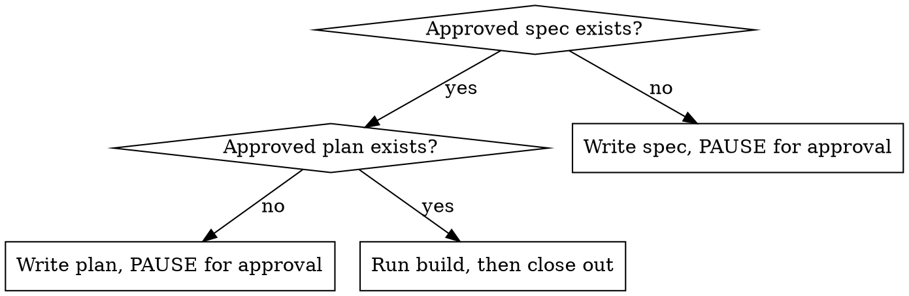

# start — drive a Jarv1s roadmap item through its next SDD stage

## Overview

`/start <issue>` picks up one roadmap item from GitHub and advances it exactly one **gate** through
the project's spec → plan → build lifecycle. **GitHub is the source of truth** for status (board
column, milestone, issue state); the markdown docs are slim pointers, never the status ledger
(see the `github-source-of-truth` memory).

Default cadence (chosen by the user): **produce spec, then plan, pausing for approval before any
code; on the next `/start` of an approved-plan issue, run the build.** One human approval gate sits
between "plan" and "code".

## Input

The argument is a GitHub issue **number**, **title** (substring), or **milestone name**. Resolve it:

```bash
# by number
gh issue view <N> --json number,title,state,body,labels,milestone
# by title/milestone substring
gh issue list --state open --json number,title,milestone --search "<text>"
```

If the argument matches 0 or >1 issues, list the candidates and ask which one. Never guess.

## Stage detection (do the NEXT stage only)



Detect by artifact, matching the milestone slug (e.g. `m-a2`) or keywords from the issue title:

```bash
ls docs/superpowers/specs/ | grep -i "<slug-or-keyword>"   # spec present?
ls docs/superpowers/plans/ | grep -i "<slug-or-keyword>"   # plan present?
```

If a file exists but you are unsure it is _approved_ (vs. a draft), ask the user before treating it
as done. "Approved" = the user has signed off, not merely that a file exists.

## Procedure

**0. Orient + guardrails (always, before any stage).**

- Get current status + the milestone/exit criteria from GitHub (project board + epic issues #2–#10;
  STATUS.md/ROADMAP.md were retired). Read `docs/DEVELOPMENT_STANDARDS.md`.
- Run the agentmemory required recalls from CLAUDE.md (at minimum `memory_smart_search "jarv1s
current project state"`; add the row matching the work — RLS, migrations, AccessContext,
  integration-test, frontend).
- Honor every **Hard Invariant** in CLAUDE.md. Do not restate them here; obey them.

**1. Resolve the issue + move the board.** Resolve per _Input_. Move the item to **In Progress** on
the project board (see _GitHub reference_) and confirm the change. This is the canonical "started"
signal — not a doc edit.

**2. Detect the stage** per the flowchart.

**3a. Spec stage** (no approved spec):

- For any unresolved product/architecture decision, **REQUIRED SUB-SKILL:** use
  `superpowers:brainstorming` (and `/brief` if the problem itself is fuzzy) to lock decisions first.
- Write `docs/superpowers/specs/<slug>.md` following the shape of existing specs
  (`docs/superpowers/specs/2026-06-06-memory-data-model-design.md` and the M-A1 spec): Context,
  Goals, Non-Goals, Resolved Decisions, Architecture, Exit Criteria, Hard Invariants honored.
- **PAUSE.** Present the spec and ask for approval. Do not proceed to planning.

**3b. Plan stage** (approved spec, no approved plan):

- **REQUIRED SUB-SKILL:** use **`plan-build`** (it supersedes `superpowers:writing-plans`, #1278 —
  the old skill's pasted-code plans caused a six-round review loop) to produce
  `docs/superpowers/plans/YYYY-MM-DD-<feature>.md`. Read the spec with fresh eyes and verify
  coverage. **Scope the plan so each build slice fits ONE agent session** (Ben, 2026-08-23): if a
  slice would plausibly need a relay, split it here, at planning time — not mid-build.
- **PAUSE.** Present the plan and ask for approval. Do not write code.

**3c. Build stage** (approved plan):

- **Work in your own worktree, never by switching the shared tree's branch:**
  `git worktree add .claude/worktrees/<slug> -b <slug> origin/main`. (`git checkout -b` on the
  shared checkout disrupts every other live session — the shared-checkout skill treats it as
  unsafe.)
- **Pick the build engine** with the heuristic below; state your recommendation and proceed unless
  the user redirects.
- Execute the plan. **The superpowers execution skills are disabled in this repo by design** — use
  the chosen engine (Workflow or built-in Agent dispatch), never `superpowers:executing-plans` or
  `subagent-driven-development`. Build agents run on **Sonnet**; each task commits green with the
  `Co-Authored-By: Claude` trailer; `git add` only that task's files.

**4. Close out** (after the build's exit criteria are met):

- Verify yourself — do not trust an agent's self-report. Run both gates through
  `scripts/run-gate.sh` (`start` → `wait` → `status`; `--gate audit:release-hardening` for the
  second). It handles the isolated gate DB and decides completion from a trap-guaranteed
  `### FINAL rc=N` sentinel — never from `pgrep`, which matches Claude's own bash wrappers
  forever and once hid a dead gate for 19 hours. **REQUIRED SUB-SKILL:**
  `superpowers:verification-before-completion`.
- GitHub bookkeeping (source of truth): check off the epic's exit-criteria boxes, **close the
  issue**, **close the milestone** if all criteria are met, move the board item to **Done**.
- Status lives in GitHub only (board + milestones); there are no status docs to update.
- Save a durable agentmemory lesson for any non-obvious decision or discovered invariant.

## Build-engine heuristic

State the recommendation and why, then proceed (the user may redirect).

| Signal                     | Lean **Background Workflow**                             | Lean **Inline Agent dispatch**                |
| -------------------------- | -------------------------------------------------------- | --------------------------------------------- |
| Task count                 | ≥ ~5 tasks                                               | ≤ ~4 tasks                                    |
| Independence / parallelism | Has safe parallel branches or a long prefetch to overlap | Tightly sequential, shares one DB / hot files |
| Token cost                 | Large; better run unattended in background               | Small; cheap to run in-session                |
| Oversight desired          | Hands-off, notify on completion                          | Review between each task                      |

Most full milestones → Workflow (sequential + any safe prefetch, as M-A1). A 1–3 task slice →
inline. When in doubt, recommend Workflow for milestones and inline for slices, and say so.

## GitHub reference (project "Issue and Roadmap Work")

**The live board is project 2.** Project 1 ("Jarv1s Roadmap") and project 3 ("Jarv1s Phase 3") are
archived — they stopped tracking at #1270 and #427. Never query those.

```
project node id : PVT_kwHOADqkaM4BarLA   (number 2, owner motioneso)
Status field id : PVTSSF_lAHOADqkaM4BarLAzhVhA6I
options         : Backlog=f75ad846  Ready=61e4505c  In progress=47fc9ee4
                  In review=df73e18b  Done=98236657
```

```bash
# find the project item id for an issue number
# --limit defaults low and short-reads SILENTLY; pass one above the item count (719 as of 2026-08-05)
gh project item-list 2 --owner motioneso --format json --limit 800   # match content.number

# move an item to a status
gh project item-edit --project-id PVT_kwHOADqkaM4BarLA \
  --id <ITEM_ID> --field-id PVTSSF_lAHOADqkaM4BarLAzhVhA6I \
  --single-select-option-id <OPTION_ID>

# close an epic / milestone at done
gh issue close <N> --comment "Exit criteria met."
gh api -X PATCH repos/motioneso/Jarv1s/milestones/<M> -f state=closed
```

## Red flags — STOP

- About to write code with **no approved spec or plan** → violates the spec-before-build gate. Stop.
- About to `git checkout` a new branch (or `git add -A`/`stash`/`reset`) while a build workflow is
  mid-run on the working tree → you will disrupt running agents or sweep their uncommitted work into
  your commit. Wait until it finishes, and send a heads-up via the `herdr-pane-message` skill (see
  CLAUDE.md → _Working in a shared checkout_, and the `shared-checkout` skill).
- About to mark an issue/milestone done from an **agent's self-report** → verify with
  `scripts/run-gate.sh` (both gates) yourself first.
- About to update only the doc and not the board → GitHub is the source of truth; move the board.
- Skipped the agentmemory recalls → locked decisions and traps may be missed.

## Common mistakes

- **Doing more than one gate.** `/start` advances ONE stage and pauses (spec→pause, plan→pause,
  then build). Don't chain spec→plan→build without the approval gate.
- **Treating "file exists" as "approved."** Ask if unsure.
- **Duplicating CLAUDE.md.** Obey its invariants and recalls; don't restate them.
