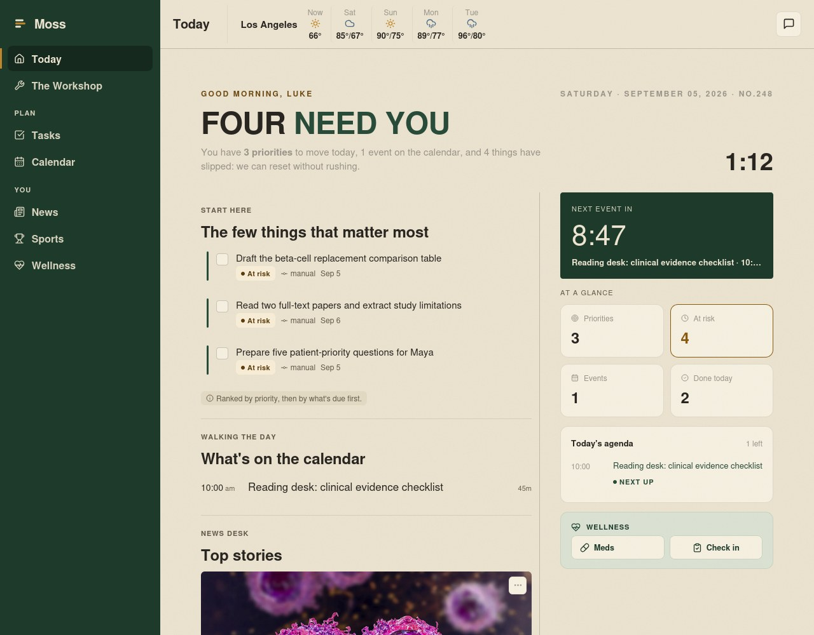
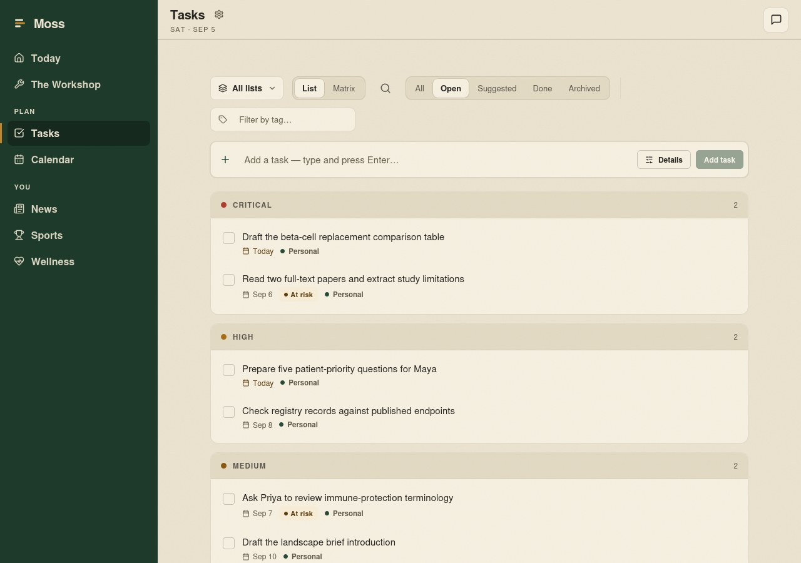
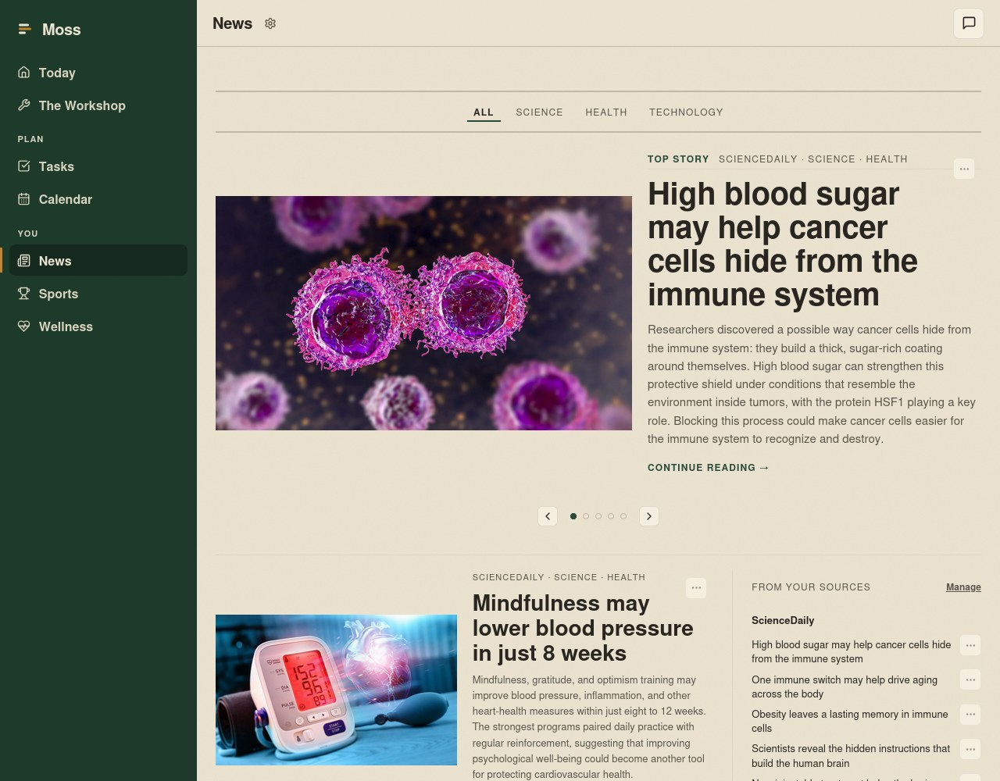
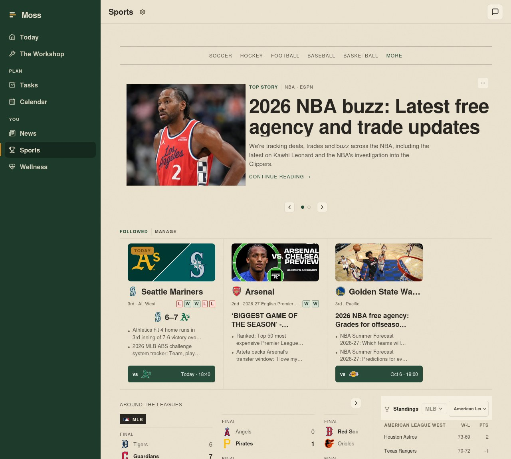
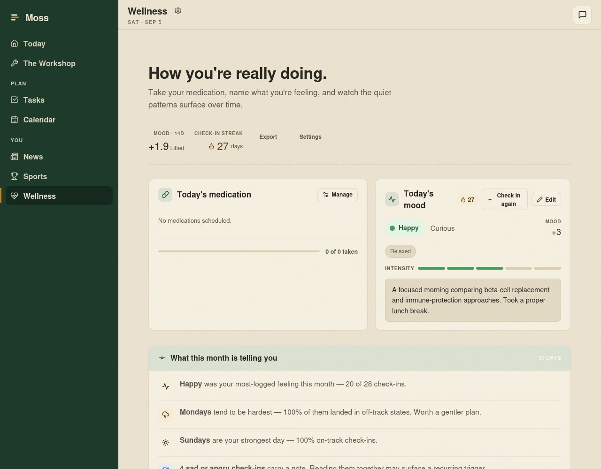
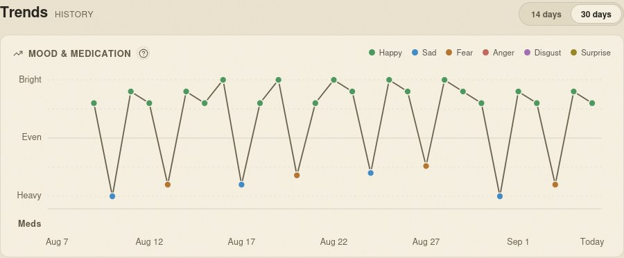

# Moss

**A self-hosted AI assistant for your everyday life.**

Moss brings your notes, tasks, calendar, email, and personal context into one place. Talk to it to plan your day, find something you saved, keep track of commitments, or work through a goal. Its modules give the assistant tools to act on your information, and give you dedicated screens to browse and manage it yourself.

Moss is in **active alpha**. Features and installation details are still evolving; expect rough edges.

## What you can do with Moss

- **Organize your life.** Manage tasks, lists, goals, commitments, and people. Ask Moss to help turn a conversation into something you can follow through on.
- **Work with your notes.** Search Markdown and Obsidian notes, create and update notes, and optionally archive conversations to your vault.
- **Bring in your accounts.** Connect email and calendar sources so your assistant can use messages and upcoming events as context.
- **Get a view of your day.** Briefings, notifications, and proactive monitoring help surface what needs attention. Follow weather, news, and sports that interest you.
- **Track your wellbeing.** Record check-ins, manage medications, and review wellness trends.
- **Build up context over time.** Memory carries useful information across conversations so you do not have to start from scratch each time.
- **Make it your own.** Enable the modules you need, install additional modules through Settings, or use Workshop to plan and build a new module with Moss.

Try asking: “What should I focus on today?”, “Find my notes about the kitchen renovation,” or “Create a task to follow up on this next week.” Available actions depend on your enabled modules, connected accounts, and permissions.

## Your assistant, your providers, your data

Moss runs on your hardware and stores its database and files there. Data is private by default; sharing is explicit, and administrator access does not bypass private-data permissions. Connector and AI credentials are encrypted at rest.

You bring your own AI access. Moss supports chat through Claude, Codex, and Gemini sign-in, along with configurable AI providers for features that need them. Set up your provider in the first-run wizard or Settings. Provider accounts, subscriptions, and API usage are separate from Moss.

**Self-hosted storage does not mean all AI processing is local.** When you use a hosted provider, prompts and relevant context are sent to that provider. Connected services and web tools also make external requests.

## A look inside Moss

Meet **Luke**, a fictional researcher organizing work toward a cure for type 1 diabetes. These screenshots come from a running Moss demo with saved research notes, tasks, goals, contacts, calendar events, and wellness check-ins. Personal data is fictional; News and Sports show public provider content captured at the time. The research workspace illustrates organization, not clinical findings or a claimed cure.

**Today** brings Luke's research priorities, calendar, and daily context together.



<details>
<summary><strong>Tasks — turn research into next actions</strong></summary>

Luke's reading, evidence checks, and writing tasks, organized by priority and due date.



</details>

<details>
<summary><strong>News — a reading desk for your sources</strong></summary>

Headlines and source summaries in one place, with links to the original reporting.



</details>

<details>
<summary><strong>Sports — follow your teams</strong></summary>

Luke follows the Mariners, Arsenal, and Warriors, with results, upcoming games, and sports coverage together.



</details>

<details>
<summary><strong>Wellness — check in and notice patterns</strong></summary>

Four weeks of fictional check-ins show how Luke balances focused research with rest and everyday life.





</details>

## Install with Docker Compose

You need Docker Engine or Docker Desktop, **Docker Compose v2.24 or newer**, and a terminal with `curl`. These commands use a POSIX shell (Linux, macOS, or WSL). No source checkout or host Node.js installation is needed.

### 1. Download the deployment file

```sh
mkdir moss
cd moss
curl -fL https://raw.githubusercontent.com/motioneso/moss/main/infra/docker-compose.prod.yml \
  -o docker-compose.prod.yml
```

### 2. Generate your configuration and secrets

```sh
JARVIS_IMAGE_TAG=stable POSTGRES_PASSWORD=setup JARVIS_CLI_RUNNER_RPC_SECRET=setup \
  docker compose -p moss -f docker-compose.prod.yml --profile setup \
  run --rm --no-deps --pull always --user "$(id -u):$(id -g)" setup
```

This writes `env.production.local` beside the Compose file, readable only by your user. The two `setup` values let Compose parse the file before secrets exist; the setup service generates fresh passwords and encryption keys instead of using those placeholders. Back up this file securely and keep it out of Git. Run setup only once.

Before starting, add this line to `env.production.local`, replacing the example with the email you will use for your first Moss account:

```dotenv
MOSS_RECONCILE_CONFIRM_OWNER_EMAIL=you@example.com
```

Moss checks this identity when reconciling modules after an owner exists. It must match your first account so subsequent starts can complete.

The image and application are named **Moss**. Some Compose service names, volume names, and `JARVIS_*` configuration keys retain their original names for compatibility; use them exactly as shown.

### 3. Start Moss

```sh
docker compose -p moss -f docker-compose.prod.yml --env-file env.production.local \
  up -d --no-build
```

Open **[http://localhost:1533](http://localhost:1533)**, create your first account with the email above, and follow the setup wizard to connect your AI provider. Then choose your modules and connect any accounts you want Moss to use.

The stack includes PostgreSQL with pgvector, the Moss app, and a supporting sports renderer. Database migrations and module reconciliation run automatically during app startup. Allow a few minutes for the first boot.

Check startup status or recent app logs:

```sh
docker compose -p moss -f docker-compose.prod.yml --env-file env.production.local ps
docker compose -p moss -f docker-compose.prod.yml --env-file env.production.local \
  logs --tail=100 jarv1s
```

For access from another device, configure its exact browser origin in `MOSS_AUTH_TRUSTED_ORIGINS` before starting. See the [deployment guide](docs/operations/deploy.md) for remote access, ports, notes mounts, and backups, and the [HTTPS guide](docs/operations/self-hosted-tls.md) for TLS setup.

### Update Moss

Back up your configuration and persistent data first, then run these commands from your installation directory:

```sh
docker compose -p moss -f docker-compose.prod.yml --env-file env.production.local pull
docker compose -p moss -f docker-compose.prod.yml --env-file env.production.local \
  up -d --no-build
```

The `stable` channel follows promoted releases. To pin a release, set `JARVIS_IMAGE_TAG` in `env.production.local` to its published version tag. Read [What's New](docs/WHATS_NEW.md) before upgrading.

For an existing installation, keep using its original Compose project name instead of switching to `-p moss`: the project name determines which persistent volumes Compose uses. Never use `down -v` unless you intend to delete the installation's volumes.

## Learn more

- [Deployment and configuration](docs/operations/deploy.md)
- [HTTPS setup](docs/operations/self-hosted-tls.md)
- [Release notes](docs/WHATS_NEW.md)
- [Module developer guide](docs/module-developer-guide.md)
- [Development environment](docs/operations/dev-environment.md) and [project rules](CLAUDE.md)
- [Report an issue](https://github.com/motioneso/moss/issues)

Moss is licensed under the [MIT License](LICENSE).
