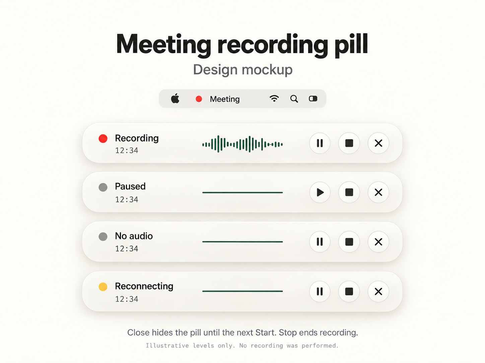

# Recording pill concept

Design reference for Part B R6/T12, following the approved spec at
`687fd2bc45e48f6a8a75068302bc332ce3e86c06`. This is an illustrative mockup, not a screenshot or
live-path proof. No recording was performed. Native layout targets 368 × 56 points; the image is
enlarged for legibility rather than a pixel-perfect rendering of that geometry.

- The waveform is intended to read actual captured audio levels. Paused, missing and stale audio
  stay flat; the drawn Recording waveform is illustrative only. Reconnecting can still show
  current captured levels while its lease remains valid; the flat example depicts no current audio.
- Pause and Stop are separate from the close control. The play icon while paused opens the existing
  Resume in Moss action; it does not add native Start authority. Close hides the pill until the next
  accepted Start and never stops capture.
- The menu-bar recording dot persists for the session, including Pause, until Stop. The pill's
  state indicator may be neutral or amber while its label explains the condition.
- The native pill can be dragged and appears above other windows on every Space. No system
  notification is part of this design.

Generated with the built-in image tool. Prompt: a simple native macOS status-pill design board,
warm off-white material with the existing forest/charcoal palette, four labeled states, elapsed
timer, actual-level waveform intent, separate Pause/Stop/Hide controls, a persistent menu-bar dot,
and explicit design-mockup/no-recording labels. The project-bound output is preserved here.
