# Spec: ACP as the single model interface in Moss

**Status:** Awaiting Ben's approval (2026-09-07, "ACP Work" room). No plan and no code until it is
approved.

**Evidence:** `spikes/acp-tool-call/RESULTS.md` (four runs on the dev instance, 2026-09-06); the
Codex, Antigravity (agy) and Claude adapter checks Scout ran on the box on 2026-09-07 (section 9); the ACP
documentation set (protocol v1 stable, v2 draft, registry, RFDs) read in full on 2026-09-07.

---

## 1. Decision

The Agent Client Protocol (ACP) is the **single interface for every model conversation in Moss**.
Chat, the Workshop, briefings, monitoring, module builds and every other feature that runs a model
does so through one ACP client adapter that launches the provider's ACP agent as a subprocess,
talks to it over JSON-RPC on stdio, and hands it Moss's own tool server at session start. Moss
owns the conversation, the permissions, the tool list and the audit trail. The agent owns the model
loop.

A **provider** is what the admin adds today (Claude, Codex, Google's agy,
...); each provider ships its own ACP agent in the protocol's public registry, and that agent is
what Moss launches. The user never chooses an agent, only a provider and (where the admin allows)
a model.

Consumers, in build order:

1. **Workshop.** A conversation whose working folder is the project folder. Shell and file writes
   are allowed. Not a sandbox: a command started there is not restricted to that folder.
2. **Chat.** A conversation in an empty scratch folder. Shell and file writes are off. The
   hand-made CLI bridge in `packages/chat/src/live/` is deleted when chat moves (section 13).
3. **Unattended calls.** Briefings, connector monitoring, module builds and anything else that
   runs a model with nobody watching (section 8).

Same adapter, same settings model, different launch profile per consumer.

Moss does **not** become an ACP agent (something other editors could host). Out of scope.

## 2. Why

- Today's chat runs a CLI subprocess and scrapes its output. That bridge produced a string of real
  bugs: fenced JSON that failed to parse, a flag that silently dropped all 101 Moss tools, a session
  id mistaken for a conversation id. ACP replaces scraping with a typed contract: content blocks,
  tool calls as events with ids and status, a permission request message, cancel.
- The spike showed the ACP path picks the right Moss tool among ~100 every run with no stray calls
  to the agent's own tools, at the same wall-clock as the bridge (10 to 18 s both arms).
- The household runs on the vendors' subscription logins through the CLIs
  (`packages/ai/src/repository.ts`, `auth_method = 'cli'`), not per-user API keys. So the honest
  comparison is bridge versus ACP. Direct API calls for API-key providers stay available through
  the router and are unaffected by this spec.
- One interface for every caller means one place to fix a bug, one permission model and one audit
  trail, instead of the four engines and three one-shot flags the bridge grew.

What ACP does **not** give us: agents talking to each other, a per-user vendor login, control over
the agent's own system prompt, or a fix for the shared subscription. Those stay Moss's problems.

## 3. Conditions (requirements, not follow-ups)

1. **Workshop first, chat second, unattended callers third.** Each consumer lands only after the
   previous one has passed the live-path gate.
2. **Every session launches through the per-user runner**, never from the box's login. The
   cli-runner engine host allocates a Unix account per user (`packages/cli-runner/src/uid-allocator.ts`)
   with a scrubbed environment and its own home folder. The spike ran as the box's own login and
   inherited that login's hooks, global instructions and plugins into the Moss session; the runner
   is the fix. Unattended callers run as the account of the user the work belongs to.
3. **Shell and file writes off in chat.** File reads, file search, web search and web fetch may
   stay on (the spike's third condition: five read-only built-ins offered, zero used). The agent's
   tool list is a fixed base list per profile, not a deny filter, kept in one table
   (`packages/acp/src/tool-table.ts`: one row per real tool name with a family and an on/off per
   profile). The use-time policy in section 7 and the launch-time off-list derive from the same
   table so they cannot drift apart. In the Workshop, shell and writes are the point.
4. **The approval card is wired to the protocol** (section 7). The one real defect the spike found;
   it ships in the first slice.
5. **Each provider has its own adapter row** (section 9). Providers share the protocol but differ
   in login, model selection and which built-ins can be switched off. A provider is offered for a
   consumer only when its row passes that consumer's requirements, checked at adapter start, not
   assumed. "Any provider works everywhere" is false and the settings screen must not imply it.
6. **Admins decide which model does what** (section 5). Every consumer asks the existing model
   router by service key; the router answers with a model on a connected provider, defaulting to the
   instance default provider. Nothing in Moss names a provider or model in code.

Stated plainly in the settings screen and here: **one subscription login per provider is shared by
the whole household**, stored on disk in the runner's per-user home or token store, outside the
encrypted credential store; the encrypted row for a CLI provider holds no secret. ACP neither fixes
nor worsens this.

## 4. Architecture

```mermaid
flowchart LR
  UI[Chat drawer / Workshop panel / unattended job] --> Moss[Moss API or worker]
  Moss --> Router[Model router: service bindings, default provider]
  Router --> Adapter[ACP client adapter]
  Adapter -- launch via cli-runner, per-user account --> Agent[Provider's ACP agent<br/>claude-acp, codex-acp, antigravity-acp]
  Agent -- session/prompt, session/update, request_permission --> Adapter
  Agent -- MCP over HTTP, per-session bearer token --> Tools[Moss tool server<br/>packages/chat/src/mcp-transport.ts]
  Tools --> Gateway[AI gateway: allowlist, policy, approve/deny]
  Gateway --> Modules[Module tools: calendar, food, ...]
```

**Adapter.** `packages/acp` (`@moss/acp`), built on the official TypeScript ACP library
(`@agentclientprotocol/sdk`), pinned to protocol v1 and negotiating the version at `initialize` so
v2 can slot in per connection (section 11). One internal interface to the rest of Moss: open
session, send prompt, stream events, answer permission, set a session option, cancel, close. Every
consumer uses this interface with a **launch profile**:

| profile      | working folder              | shell / writes | built-in reads, search, web | streaming to a person | history replay |
| ------------ | --------------------------- | -------------- | --------------------------- | --------------------- | -------------- |
| `workshop`   | the project folder          | on             | on                          | yes                   | yes            |
| `chat`       | empty scratch folder        | off            | on                          | yes                   | yes            |
| `unattended` | caller's choice (section 8) | per caller     | per caller                  | no                    | no             |

**Provider resolution.** The adapter never picks a provider. It receives a resolved model
(provider id, model id, provider kind) from the router (section 5) and maps the provider kind to a
registry adapter row (section 9): which command to launch, how the login reaches it, how the model
is set, which built-ins can be switched off.

**Launch.** Through the cli-runner engine host: per-user account, scrubbed environment, own home,
the profile's working folder. The launch command comes from the registry entry for the provider,
pinned by version in Moss (section 9), never resolved live at run time. The vendor login reaches
the agent the way each provider's row says. Nothing secret ever goes on the command line.

Known limits, stated rather than papered over:

- The login credential is inside the agent's own process, because the provider's CLI needs it to
  reach its vendor. The runner's read-deny rules, the per-user account and the forbidden zone in
  section 7 each raise the bar; none removes the fact. The real fix is a Moss-side relay that adds
  the credential on the way out so the child never holds it. A runner change with its own spec.
- Folder containment is lexical. A link inside the project pointing at a secret passes the check,
  because the decision runs on the API side and cannot resolve paths on the runner host. The
  per-user account is the containment that does not care about paths, and it exists only when the
  per-user identity option is on. Follow-up: the runner resolves announced paths before they cross
  the pipe, or per-user identity becomes the Workshop default.

**Tool server.** The existing MCP transport, unchanged. Moss mints the per-session bearer token
(`jst_<uuid>`, one per session) and passes it inside the `session/new` `mcpServers` entry as an
HTTP header. It travels over the stdio pipe only. Every tool call is attributable to the token that
carried it. **The agent identity does not go into `AccessContext`**; that carries only
`actorUserId` and `requestId` by ruling.

**Capabilities advertised to the agent.**

| capability                                | chat | Workshop        | unattended | why                                                                                                                           |
| ----------------------------------------- | ---- | --------------- | ---------- | ----------------------------------------------------------------------------------------------------------------------------- |
| `fs/read_text_file`, `fs/write_text_file` | no   | no              | no         | v2 removes client file access; files are served as Moss tools scoped to the project folder so the v2 move does not touch them |
| `terminal/*`                              | no   | no (see fork A) | no         | same reason; commands run through a Moss tool that starts in the session folder                                               |
| agent built-in shell / file-write         | off  | on              | per caller | condition 3                                                                                                                   |
| agent built-in read / search / web        | on   | on              | per caller | spike third condition                                                                                                         |
| `auth.terminal`                           | yes  | yes             | no         | lets an admin complete a provider's interactive login through the runner (section 9); never offered to an unattended session  |

**Fork A, how the Workshop runs commands. Decided (review, 2026-09-06): (1).** A Moss tool starts
the command with the project folder as its working folder and streams output, v2-proof and audited
like every other tool. The working folder is fixed, the command itself is not restricted, and the
only thing between a caller and an arbitrary command is the approval card. (2), advertising ACP
`terminal/*`, is taken only if the slice 1 live proof shows the tool cannot stream a build log well
enough; record the reason in the plan if so.

**Conversation history.** Postgres stays the record, under row-level access. A fresh agent session
gets history replayed by Moss, the way a stateless model call does today. The agent's own session
is a cache; `session/load` (v1) or `session/resume` (v1 stabilized, v2) is used only when the
provider advertises it and the process is still alive.

## 5. Who decides which model does what

Moss already has the mechanism: **service bindings** (`ai.service_bindings`, resolved in
`packages/ai/src/repository.ts`). A caller names a service key; the router answers with a model
on a connected provider. The order today, kept unchanged:

1. an admin's per-user pin (`/api/admin/users/:userId/ai-pin`),
2. a module-specific binding (`module.<id>`),
3. the binding for the service key (`{kind: "model", modelId}` or `{kind: "mode", tier}`),
4. the **instance default provider**, picked by tier.

The user's own chat model override stays as today, gated by the admin's
`ai.chat_model_override.enabled` and each model's `allowUserOverride`.

This spec adds **service keys, not a new picker**:

| service key                             | who calls it                                       | default when unbound      |
| --------------------------------------- | -------------------------------------------------- | ------------------------- |
| `chat`                                  | the chat drawer (exists today)                     | instance default provider |
| `workshop`                              | every Workshop conversation and every module build | instance default provider |
| `tool-use`, `json`, `summarization`, .. | unattended callers, by capability (exist today)    | instance default provider |
| `module.<id>`                           | a module's own AI requests (exists today)          | the capability's binding  |

The **Workshop model setting Ben asked for** ("which model does the building, chosen only from
providers he has already connected") is the `workshop` row in the existing bindings screen. The
list it offers is the connected providers' models and nothing else. There is no second settings
system, and no code path may name a provider.

**How the chosen model reaches the agent.** The resolved model's provider selects the adapter row
(section 9). The model id is passed to the agent through the protocol's own selector where the
adapter exposes one: the `configOptions` entry with `category: "model"` returned by `session/new`,
set with `session/set_config_option`. Claude's adapter exposes this option (Scout read it in the
adapter source, 2026-09-07), so a `workshop` binding to a specific Claude model is honoured. Where
the adapter has no such option, the row names its own mechanism (Codex: the `CODEX_CONFIG` launch
setting). Where the adapter offers neither, the only
choice for that provider is the login's own default model, and the bindings screen says so beside
that provider instead of offering models it cannot honour. The sentinel `default` keeps its meaning:
the provider account's own model.

**A model change mid-conversation** starts a new agent session on the new provider with history
replayed from Postgres. Switching models inside one session is allowed only when the new model is on
the same provider and the adapter exposes the model option.

## 6. Sessions and lifecycle

- One agent process per (user, consumer, conversation). Chat processes are reaped after the idle
  timeout chat already uses (the plan reads the existing value). The Workshop keeps its process for
  the life of the project tab; a browser reload reconnects to the live process if it is still up
  (`session/load` or `session/resume` where advertised), otherwise replays from Postgres. Unattended
  sessions close as soon as the prompt returns.
- `session/cancel` is wired to the chat drawer's stop button, the Workshop's cancel and the job
  runner's timeout. On cancel, every pending permission request is answered `cancelled`, as the
  protocol requires.
- Stop reasons (`end_turn`, `max_tokens`, `max_turn_requests`, `refusal`, `cancelled`) and errors
  surface as typed events, never as parsed text. A `refusal` is shown to the person as a refusal; an
  unattended caller treats it as a failed call, not an empty answer.
- Session ids are the agent's; conversation ids are Moss's. Separate columns, never substituted (the
  1888 lesson).
- One prompt at a time per session, as the protocol requires. A second send while a turn is running
  is queued by Moss, not sent.

## 7. Permissions and the approval card

**The defect.** Creating a calendar event is `risk: "write"` in the calendar manifest, so the
gateway (`packages/ai/src/gateway/gateway.ts`, `confirmAndRun`) raises an approval request and
waits up to 150 s. The MCP client library gives up after 60 s of silence. In an unattended run the
agent saw a timeout, retried once, and reported failure at 130 to 205 s. With an approver present
the same request finished in 16 s with exactly one event written. Not a broken tool; mismatched
clocks.

**Design.**

1. While a call is held for approval, the tool server sends MCP progress notifications every 20 s
   so the client's clock resets. The hold can then run the full 150 s.
2. If the hold expires or is denied, the tool reply says so in words the agent will not retry on:
   "This action was not approved. Do not retry; tell the user."
3. The gateway's approval request is also surfaced through ACP's `session/request_permission`
   handler, so the person sees one card whichever path raised it. The gateway remains the
   enforcement point; the protocol message is a second way to show the same card, never a second
   policy.
4. Ben's posture holds: installing a module grants normal use; only write and destructive tools ask
   at use time. The agent's own permission prompts (for its built-ins) are answered by Moss from one
   policy keyed on the tool's real name, taken from the agent's own tool-call announcement and
   matched by tool call id, never from the display title, which the model writes. The rule, by
   family from the table in section 3:
   - No name, or a name outside the table: refused, no card.
   - Reads fall into three zones. Inside the session folder: allowed silently, except secret-shaped
     names (`.env`, keys, certificates, `.npmrc`, `.netrc`), which ask with the path on the card. A
     fixed forbidden zone, the agent's home (token store, the CLI's own config, other providers'
     logins) plus `/proc`, `/sys`, `/dev`, `/run`, is refused with no card. Anywhere else asks once.
   - Web fetch is silent except toward loopback, private ranges, link-local and bare hostnames,
     which ask with the address on the card. Web search is silent.
   - Writes inside the folder are ordinary use; the forbidden zone refuses; elsewhere asks. Shell
     always asks, marked destructive.
   - Moss's own tools are waved through at the agent-side prompt: the tool server's gateway already
     decides the real call with its own card, allowlist and audit.
   - Mode changes and tools never offered (subagents, skills, slash commands) refuse; a refusal
     makes a wrong launch list visible.
     The record: the pending row and every audit line carry the agent session id, tool call id, real
     tool name, session folder, the paths named (capped) and the decision word; never a command or
     contents. Every ask outcome and every refusal writes an audit line; silent allows write nothing.
     The card reads "The agent wants to use <real name>" followed by the paths, address or command.
5. **Unattended sessions never raise a card.** A permission request in an unattended session is
   answered from the same policy; anything the policy would have asked a person about is refused
   with the "not approved" wording, and the refusal is in the job's audit line. No job waits on a
   human.

## 8. Non-interactive calls

Anything that runs a model with nobody watching. Inventory complete (Scout traced every caller
end to end, 2026-09-07). There are two shapes: a **working session** (tools on, a folder, waits for
the model to finish) and a **one-question call** (text in, one bounded structured answer out, no
tools). Every row below is one or the other:

| caller                                                                                                    | needs tools                     | needs JSON answer | today                                                                            |
| --------------------------------------------------------------------------------------------------------- | ------------------------------- | ----------------- | -------------------------------------------------------------------------------- |
| module build job (`packages/ai/src/module-build/`)                                                        | yes, shell + writes in a folder | no                | launches the full CLI, polls a marker for up to 30 min                           |
| connector monitoring, sync, mail sync, dependency extraction, source context (`packages/connectors/src/`) | no                              | yes               | one-shot `claude -p` / `gemini -p` / `codex exec` through `CliStructuredAdapter` |
| module plan writing (`packages/ai/src/module-build/write-plan.ts`)                                        | no                              | yes               | same one-shot path                                                               |
| installed modules asking for AI (`external-module-ai-bridge.ts` in api and worker)                        | no                              | yes               | same one-shot path                                                               |

Briefings do not call a model unattended today; if one does later, it is a one-question call and
takes that row's shape.

**Ruled (Ben, 2026-09-07): every unattended call is a short ACP session.** One way of talking
to models, so a change is made in one place. `session/new` with the `unattended` profile, one `session/prompt`, read the stop reason,
`session/close`. The one-shot CLI flags are not kept.

- **Structured answers, requested and checked over the protocol.** The caller hands the adapter
  its schema (the same schema it validates against today). The adapter puts the schema and the
  instruction "answer with one JSON object and nothing else" into the prompt, and no tool server is
  attached. The answer is the text of the agent's message chunks for that turn, joined in order,
  not the CLI's own structured-output flag, which ACP has no field for and each CLI spells
  differently. Checking is three steps in one place, in the adapter: strip a surrounding code fence
  if the model added one (the old bridge's fenced-JSON bug, now handled once for every provider),
  parse, validate against the caller's schema. A failure of any step sends one follow-up prompt in
  the same session quoting the validation error and asking for the object again; a second failure
  ends the call as failed with the stop reason and the validation error in the audit line, never as
  an empty answer. A `refusal` or `max_tokens` stop reason fails the call the same way without a
  retry.
- **Tools:** the tool server is handed in only when the caller's profile asks for it. Pure JSON
  callers get no tool server, so the model cannot wander.
- **Module build** is a Workshop-shaped unattended session: project folder, shell and writes on,
  Moss's tools in, no card (section 7 point 5), the job waits for the prompt's stop reason instead
  of polling a marker file. Its model comes from the `workshop` service key.
- **Timeouts** stay per caller as today (the build's 30 min, the connectors' existing budgets) and
  end with `session/cancel` then `session/close`.
- **Why not keep the one-shot flags:** they are the bridge. Keeping them keeps three parsers, three
  login paths and the fenced-JSON class of bug alive, and the bridge deletion (section 13) could not
  be complete. A short ACP session costs one process launch per call, which is what the one-shot
  flags cost today.

The alternative, keeping `claude -p` and friends for JSON callers, was put to Ben and rejected on
2026-09-07 ("having ONE way of interacting with models is the best"). It is not taken back in a
plan; a slow JSON caller is tuned inside the session, not moved off the protocol.

## 9. Providers and their adapters

ACP is the one interface, but **each provider ships its own agent with its own behaviour**. Moss
pins one registry entry per provider kind and records, per row, how login, model choice and
built-in tool control work. The public registry
(`https://cdn.agentclientprotocol.com/registry/v1/latest/registry.json`, version 1.0.0, curated to
agents that support authentication) is the source of the launch commands; Moss pins versions and
bumps them on purpose, never at run time.

| requirement                                                           | chat | Workshop | Claude (`claude-acp`, `@agentclientprotocol/claude-agent-acp@0.75.1`)                                        | Codex (`codex-acp`, `@agentclientprotocol/codex-acp@1.10.0`)                    | Google agy (`antigravity-acp`, binary from the registry)                                                                                                 |
| --------------------------------------------------------------------- | ---- | -------- | ------------------------------------------------------------------------------------------------------------ | ------------------------------------------------------------------------------- | -------------------------------------------------------------------------------------------------------------------------------------------------------- |
| ACP v1 `initialize`, `session/new`, `session/prompt`, updates, cancel | yes  | yes      | yes                                                                                                          | yes                                                                             | yes                                                                                                                                                      |
| accepts `mcpServers` over HTTP with headers at session start          | yes  | yes      | yes (spike)                                                                                                  | yes (`mcpCapabilities.http`)                                                    | to verify on the box                                                                                                                                     |
| built-in shell and file-write switchable off by the client            | yes  | no       | yes (`_meta` disallowed-tools list, confirmed in source)                                                     | yes (`INITIAL_AGENT_MODE=read-only`)                                            | no known switch; Workshop-only until one is found                                                                                                        |
| model selectable by the client                                        | no   | no       | yes (`configOptions` model, set with `session/set_config_option`; Scout read the adapter source, 2026-09-07) | yes (`CODEX_CONFIG` JSON at launch; `configOptions` model where advertised)     | to verify (`configOptions` model)                                                                                                                        |
| login reuse: runs headless with the CLI's stored login                | yes  | yes      | yes (runner token store, `CLAUDE_CODE_OAUTH_TOKEN` in env)                                                   | yes (reuses the Codex CLI's own on-disk login automatically; Scout, 2026-09-07) | **no**: `session/new` answers "Authentication required" even with agy logged in on the box; it wants its own login over the protocol (Scout, 2026-09-07) |

Result today: **Claude and Codex on both consumers; agy on neither** until its login row goes
green. (The plain Gemini CLI is not a Moss provider; Google's CLI on this box is agy.) A new provider is added by filling in a row, checked live on dev, not by editing code paths.

**Login, per provider.** Adding a provider and logging its CLI in stays exactly today's flow in
Settings, Assistant & AI. What changes is what happens after: ACP takes over, and the adapter
checks login at `initialize` rather than assuming it.

- The v1 protocol has no stable "am I logged in" query (`auth/status` is an accepted draft only).
  So the adapter treats an `auth_required` error on `session/new` as "not logged in" and shows the
  provider's status in the bindings screen as "Not logged in", the wording the screen already uses.
- A provider whose agent advertises an `agent`-type auth method is logged in by Moss calling
  `authenticate`. One that advertises only a `terminal`-type method (the CLI's own interactive
  sign-in) is logged in by the runner running that command for the admin, interactively, through the
  existing sign-in helper; this is the `auth.terminal` client capability in section 4, offered to
  attended sessions only. agy needs one of these paths (which one its agent advertises is checked in
  slice 3); agy is offered only after the path passes on dev.
- `logout` is called where advertised when the admin removes a provider; otherwise the runner
  removes the per-user home's credential files as it does today.

**Model listing.** The "Refresh models" button on a provider card keeps today's per-CLI list
adapter. ACP's `configOptions` is an additional source where the agent advertises a model option,
and the two are reconciled in the plan, not here.

## 10. Settings and app map

- **Settings, Assistant & AI.** No new screen and no agent picker. The provider cards stay as they
  are. The bindings list gains the `workshop` row (section 5), each provider card shows the
  shared-login sentence, and a provider whose adapter cannot honour a model choice says so beside
  its model list. The "Not logged in" state is driven by the adapter's `initialize` check.
- **App map.** The `aiproviders` entry in `packages/shared/src/app-map-core.ts` is updated in the
  build PR for the `workshop` binding, the login-check wording and the "not approved, ask the user"
  error; Workshop and chat behaviour changes go in their owning manifests' `features`.
- **Workshop hook.** The Workshop already answers each saved message in a project. The ACP adapter
  replaces the answering engine behind that path; the message model, project folder and artifact
  panel stay as they are.
- No new required environment variable. Everything is set in the app.

## 11. Protocol version strategy

Pin v1. Negotiate at `initialize` (the client sends the newest it supports; the agent answers with
the same or its own latest). Known v2 changes, all draft and breaking: prompt returns immediately
and the stop reason arrives on a state update; `tool_call` becomes an id-keyed upsert; client file
and terminal access removed in favour of MCP servers; `session/load` folded into `session/resume`;
modes folded into config options; `auth/login` and `auth/logout`. Because this design already serves
files and commands as Moss tools, passes the model through config options, and keeps Postgres as
the record, the v2 migration is confined to the adapter's event handling and auth calls. The
adapter keeps two thin protocol surfaces behind one shared core, chosen per connection, so a
provider that moves to v2 first does not force the others.

## 12. Later: several sessions in one conversation

Out of scope for this build, recorded so the design does not close the door. Each extra session is
another token; the token can carry a narrower tool list, so a "finance seat" sees finance tools
only, using the gateway's existing allowlist. Moss is the hub deciding which seats to wake; the
protocol has no agent-to-agent message. Cost scales per seat.

## 13. Slices and gates

1. **Adapter + Workshop.** The protocol package `packages/acp` (client, capability check,
   permission classifier, tool table, stream, tunnel), launch through the runner, tool server handed
   in, Fork A as decided, approval wiring (section 7), the `workshop` service key and its bindings
   row, app map. Claude and Codex rows verified live. Live-path proof: a real project, a real build
   command, a real approval card answered by a person on dev, once on each of the two providers.
2. **Chat.** Same adapter, `chat` profile (scratch folder, writes and shell off). **The CLI bridge
   (`packages/chat/src/live/`, its engine selection and the four engines) is deleted in this
   slice. No fallback setting** (Ben, 2026-09-06, reaffirmed 2026-09-07). Live-path proof: "add
   lunch with Sam" approved in the drawer and one event in the calendar, on the instance default
   provider and on a second bound provider.
3. **Unattended callers and the remaining login path.** Every row of the section 8 table moves to
   a short ACP session and the one-shot engines and `CliStructuredAdapter` are deleted. The
   terminal-type login path lands; agy is offered only once its row passes on dev. Live-path
   proof: one connector monitoring run and one module build finishing unattended with the audit
   lines in section 7 point 5, plus an agy session on dev if the login passes.

**Kill gate after slice 1:** if the approval wiring cannot make an attended write finish in under
30 s end to end on dev, on the instance default provider, stop and reassess before touching chat.

**Kill gate after slice 2:** if a chat turn through ACP is not within the bridge's wall-clock on
the same prompt set as the spike, measured on dev, stop before moving the unattended callers.

## 14. Non-goals

Moss as an ACP agent; agent-to-agent messaging inside the protocol; building on v2 now; a new
credential model or provider system; per-user vendor subscriptions; the draft custom-endpoint RFD
(`providers/*`); a module marketplace; real OAuth callbacks.

## 15. Open questions for Ben

None open. Resolved on 2026-09-07:

- **Google agy** stays off the offered list, watched for an adapter update; the protocol sign-in
  path through the runner is built in slice 3 and agy is offered once it passes on dev (Ben,
  2026-09-07). Slices 1 and 2 do not wait on it.
- **Unattended calls** run as short ACP sessions; the one-shot print and exec paths are deleted
  with the bridge, no fallback (Ben, 2026-09-07). Section 8's caller table fills in as Scout
  confirms rows; the ruling does not change with the rows.

## 16. Review record

Rulings folded in: Fork A, reaping and reload, delete the bridge with no fallback (Ben,
2026-09-06); ACP as the single interface, admin-chosen model per service defaulting to the instance
default provider, unattended calls as short ACP sessions, agy off the list until its login path
passes (Ben, 2026-09-07). Awaiting Ben's approval.
