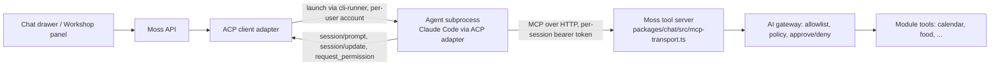

# Spec: Moss as an Agent Client Protocol (ACP) client

**Status:** Approved (Fitz, Muse review; Ben rulings folded in). Decided in the "Moss Work" room on 2026-09-06 after a
for/against debate (Fable for, Foble against, Fitz facilitating, Muse researching) and a measured
spike. Build issue: to be opened once this spec is approved.

**Evidence:** `spikes/acp-tool-call/RESULTS.md` (four runs on the dev instance, 2026-09-06).
The spike code stays in `spikes/`; nothing in it ships.

**Build timing:** no code until PRs 2364 (Workshop home page), 2365 (Moss answers in a Workshop
project) and 2358 (prod chat fix) have merged. Both Workshop PRs touch the surface this spec plugs
into. Section 8 is written against 2365 and is marked accordingly.

---

## 1. Decision

Moss becomes an **ACP client**: it launches an outside coding agent (Claude Code today, others
later) as a subprocess, talks to it over the protocol's JSON-RPC-on-stdio, and hands it Moss's own
tool server at session start. Moss owns the conversation, the permissions, the tool list, and the
audit trail. The agent owns the model loop.

Two surfaces, in this order:

1. **Workshop** — the agent works on a project. Unanimous yes; the working folder is a
   folder Moss controls. It is not a sandbox: a shell command started there is not restricted
   to it.
2. **Chat** — the agent replaces today's hand-made CLI bridge (`packages/chat/src/live/`), which
   launches the Claude CLI and parses its output. Yes, with the five conditions in section 3.

Moss does **not** become an ACP agent (something other editors could host). That is a different
product and is out of scope.

## 2. Why

- Today's chat already runs a CLI subprocess and scrapes it. The bridge produced a string of real
  bugs (fenced JSON that failed to parse, a flag that silently dropped all 101 Moss tools, a
  session id mistaken for a conversation id). ACP replaces the scraping with a typed contract:
  typed content blocks, tool calls as events with ids and status, a permission request message,
  and cancel.
- The spike showed both paths pick the right Moss tool among ~100, every run, with no stray
  calls to the agent's own tools. Wall-clock is the same within noise (read: 10–18 s both arms).
- The household runs on the vendors' subscription logins through the CLIs (see
  `packages/ai/src/repository.ts`, `auth_method = 'cli'`), not per-user API keys. So the honest
  comparison was bridge versus ACP, not subprocess versus direct API call. Direct calls stay
  available through the router for API-key providers and are unaffected by this spec.
- The same session shape gives Moss a path to hosting several agents at once (section 10).

What ACP does **not** give us, stated so nobody assumes it: agents talking to each other, a
per-user vendor login, control over the agent's own system prompt, or a fix for the shared
subscription. Those stay Moss's problems.

## 3. The five conditions (requirements, not follow-ups)

1. **Workshop first, chat second.** Chat lands only after the Workshop adapter has passed the
   live-path gate.
2. **Chat launches through the per-user runner**, never from the box's login. The cli-runner
   engine host already allocates a Unix account per user (`packages/cli-runner/src/uid-allocator.ts`)
   with a scrubbed environment and its own home folder. The spike ran as the box's own login and
   inherited that login's hooks, global instructions and plugins into the Moss session. The runner is the
   fix, and the same per-account home folder is where the agent's settings file lives.
3. **Shell and file writes off in chat.** File reads, file search, web search and web fetch may
   stay on (the spike's third condition: five read-only built-ins offered, zero used on calendar
   prompts). In the Workshop, shell and writes are the point, starting in the project folder
   (not restricted to it). One table, `packages/acp/src/tool-table.ts` (one row per real tool
   name, with a family and an on/off per surface), drives both the use-time policy in section 6
   and the launch-time off-list so they cannot drift apart. The launch-time control is honestly
   a removal list: the adapter (0.16.2, `acp-agent.js`) overwrites any allow list sent in
   `_meta.claudeCode.options` with its full tool preset and only merges `disallowedTools`, so
   the client sends the table's off-list for the surface as `disallowedTools` and relies on the
   use-time refusal for anything the list does not name. Phase 5 wired exactly that.
4. **The approval card is wired to the protocol** (section 6). This is the one real defect the
   spike found, and it ships in the first slice.
5. **An agent capability list** (section 7) decides which agents may be offered on which
   surface. "Any ACP agent works with Moss" is false and the settings screen must not imply it.

Plus, stated plainly in the settings screen and in this spec: **one subscription login per agent
is shared by the whole household**, stored on disk in the runner's token store, outside the
encrypted credential store; the encrypted row for a CLI provider holds no secret at all. ACP
neither fixes nor worsens this. It is today's arrangement, carried forward knowingly.

## 4. Architecture

**Adapter.** One new package (name decided in the plan) built on the official TypeScript ACP
library, pinned to protocol v1, negotiating version at `initialize` so v2 can slot in per
connection later. It exposes one internal interface to the rest of Moss: open session, send
prompt, stream events, answer permission, cancel, close. Both surfaces use the same adapter with
different launch settings.

**Launch.** Through the cli-runner engine host, same as the bridge today: per-user account,
scrubbed environment, own home, empty scratch working folder (chat) or the project folder
(Workshop). The vendor login comes from the runner's token store via the environment. Nothing
secret ever goes on the command line (the room saw the hub leak its own tokens through `ps`).

Known limits, stated rather than papered over (phase 4 review, 2026-09-07):

- The login credential is inside the agent's own process: the coding CLI needs it to reach its
  provider, so it sits in that process's environment and in a file under its home. The policy's
  forbidden zone, the runner's native read-deny rules and the per-user account each raise the
  bar; none removes the fact. The real fix is a Moss-side relay that adds the credential on the
  way out so the child never holds it — a runner change with its own spec and issue.
- Folder containment is lexical. A link inside the project pointing at a secret passes the check,
  because the decision runs on the API side and cannot resolve paths on the runner host. The
  per-user account plus the 0600 token file is the containment that does not care about paths,
  and it exists only when the per-user identity option is on; with it off, file permissions
  narrow nothing. Follow-up: either the runner resolves announced paths before they cross the
  pipe, or per-user identity becomes the Workshop default.

**Tool server.** The existing MCP transport, unchanged. Moss mints the per-session bearer token
(`jst_<uuid>`, one per session, per agent) and passes it inside the `session/new` `mcpServers`
entry as an HTTP header. It travels over the stdio pipe only. Every tool call is attributable to
the token that carried it, which is how the audit trail knows which agent (and which council
seat, later) made a call. **The agent identity does not go into `AccessContext`**; that carries
only `actorUserId` and `requestId` by ruling.

**Capabilities advertised to the agent.**

| capability                                | chat | Workshop                           | why                                                                                                                                                                   |
| ----------------------------------------- | ---- | ---------------------------------- | --------------------------------------------------------------------------------------------------------------------------------------------------------------------- |
| `fs/read_text_file`, `fs/write_text_file` | no   | no                                 | v2 removes client file access; serve files as Moss tools scoped to the project folder instead, so the v2 migration does not touch file handling                       |
| `terminal/*`                              | no   | no (see fork A)                    | same reason; commands run through a Moss tool that starts with the session project folder as its working folder (the command itself is not restricted to that folder) |
| agent built-in shell / file-write         | off  | on, starting in the project folder | condition 3                                                                                                                                                           |
| agent built-in read / search / web        | on   | on                                 | spike third condition                                                                                                                                                 |

**Fork A — how the Workshop runs commands. Decided (review, 2026-09-06): (1).** A Moss tool
starts the command with the project folder as its working folder and streams output, v2-proof
and audited like every other tool. Say plainly what is true: the working folder is fixed, the
command itself is not restricted, and the only thing standing between a caller and an arbitrary
command is the approval card. (2), advertising ACP `terminal/*`, is taken only if the slice 1
live proof shows the tool cannot stream a build log well enough; record the reason in the plan
if so.

**Conversation history.** Postgres stays the record, under row-level access. A fresh agent
session gets history replayed by Moss, the way a stateless model call does today. The agent's own
session is a cache; `session/load` is optional in the protocol and is used only when the agent
supports it and the process is still alive.

## 5. Sessions and lifecycle

- One agent process per (user, surface, conversation). Chat processes are reaped after the same
  idle timeout chat already uses for its sessions (the plan reads the existing value rather than
  inventing one). The Workshop keeps its process for the life of the project tab, and a browser
  reload is not closing the tab: reconnect to the live process if it is still up (`session/load`
  where supported), otherwise replay from Postgres.
- `session/cancel` is wired to the chat drawer's stop button and the Workshop's cancel.
- Stop reasons and errors surface to the UI as typed events, never as parsed text.
- Session ids are the agent's; conversation ids are Moss's. They are stored in separate columns
  and never substituted for one another (the 1888 lesson).

## 6. Permissions and the approval card

**The defect.** Creating a calendar event is `risk: "write"` in the calendar manifest, so the
gateway (`packages/ai/src/gateway/gateway.ts`, `confirmAndRun`) raises an approval request and
waits up to 150 s (`packages/chat/src/live/claude-permission-hook.ts`). The MCP client library
gives up after 60 s of silence (`DEFAULT_REQUEST_TIMEOUT_MSEC`). In an unattended run the agent
saw a timeout, retried once, and reported failure at 130–205 s. With an approver present the same
request finished in 16 s with exactly one event written. Not a broken tool; mismatched clocks.

**Design.**

1. While a call is held for approval, the tool server sends MCP progress notifications every
   20 s so the client's clock resets. The hold can then run the full 150 s.
2. If the hold expires or is denied, the tool reply says so in words the agent will not retry on:
   "This action was not approved. Do not retry; tell the user." The spike showed the agent
   retries a bare timeout exactly once, so the wording matters.
3. The gateway's approval request is also surfaced through ACP's `session/request_permission`
   handler, so the person sees one card in the UI whichever path raised it. The gateway remains
   the enforcement point; the protocol message is a second way to display the same card, never a
   second policy.
4. Ben's posture holds: installing a module grants normal use, only write/destructive tools ask
   at use time. The agent's own permission prompts (for its built-ins) are answered by Moss from
   one policy keyed on the tool's real name, taken from the agent's own tool-call announcement
   and matched to the question by tool call id — never from the display title, which the model
   writes and must not decide. Title-matching was considered and rejected: it lets the model
   choose its own policy. The rule, by family from the table in section 3:
   - No name (no announcement within a short bound), or a name outside the table: refused, no
     card. The only text available for an unnamed tool is the model's, so nobody is asked.
   - Reads fall into three zones. Inside the session folder: allowed silently, except
     secret-shaped names (`.env`, keys, certificates, `.npmrc`, `.netrc`), which ask with the
     path on the card. A small fixed forbidden zone — the agent's home (token store, the coding
     CLI's own config, other providers' logins) plus `/proc`, `/sys`, `/dev`, `/run` — is refused
     with no card, because no person can sensibly approve it. Anywhere else asks once, path on
     the card.
   - Web fetch is silent except toward loopback, private ranges, link-local and bare hostnames,
     which ask with the address on the card. Web search is silent.
   - Writes inside the folder are ordinary use; the forbidden zone refuses; elsewhere asks.
     Shell always asks, marked destructive.
   - Moss's own tools are waved through at the agent-side prompt: the tool server's gateway
     already decides the real call with its own card, allowlist and audit.
   - Mode changes and tools never offered (subagents, skills, slash commands) refuse; if one
     arrives, the launch list is wrong and the refusal makes that visible.
     Example: a subagent titled "Read the repo" is refused outright while a named Read of a project
     file is allowed quietly and a named shell run raises the card. The record: the pending row
     and every audit line carry the agent session id, tool call id, real tool name, session folder,
     the paths a read or write named (capped) and the decision word; never a command or contents.
     Every ask outcome and every refusal writes an audit line; silent allows write nothing. The
     card reads "The agent wants to use <real name>" followed by the paths, the address or the
     command; the model's own description appears only when there is nothing else, and labelled
     as its description. Reads and fetches that reach a person show as "outbound" seriousness.
     Points 2 and 3 above are untouched by this change. Open flags from the phase 4 QA review,
     not this slice: the blocked user identity behind the token, borrowing the chat session
     identity, several agents sharing one conversation, and the token plus folder on MCP tool
     holds; the launch-time limits are recorded in section 4.

## 7. Agent capability list

An agent may be offered on a surface only if it meets that surface's row. Checked at adapter
start, not assumed.

| requirement                                                                     | chat | Workshop | Claude Code (via ACP adapter)             | Gemini CLI                                    |
| ------------------------------------------------------------------------------- | ---- | -------- | ----------------------------------------- | --------------------------------------------- |
| ACP v1 `initialize`, `session/new`, `session/prompt`, streaming updates, cancel | yes  | yes      | yes                                       | yes                                           |
| accepts `mcpServers` over HTTP with headers at session start                    | yes  | yes      | yes                                       | yes                                           |
| built-in shell and file-write tools can be switched off by the client           | yes  | no       | yes (base tool list, confirmed in source) | no (ignores the setting)                      |
| runs headless with a stored login                                               | yes  | yes      | yes                                       | blocked on this box (needs interactive login) |

Result today: Claude Code on both surfaces; Gemini CLI Workshop-only, and only once it has a
login. Codex and others are added by filling in a row, not by editing code paths.

## 8. Settings, app map, and the Workshop hook (pending PR 2365)

- **Settings → AI providers** gains an "agent" choice per surface (chat, Workshop) listing only
  agents that pass section 7 for that surface, with the shared-login sentence shown beside CLI
  providers. The admin sets the household default per surface and users override where they can
  override the provider today. That is the existing choose-a-provider behaviour carried over; only
  the way the chosen agent is launched and spoken to changes (Ben, 2026-09-06). Model choice stays with the router's picker; the sentinel `default` continues to mean
  "the agent's own account model".
- App-map entries for the new setting, the two surfaces' new behaviour, and the "not approved,
  ask the user" error are updated in the build PR (core screens in
  `packages/shared/src/app-map-core.ts`; module surfaces in the owning manifests).
- **Workshop hook:** PR 2365 makes Moss answer each saved message in a project. The ACP adapter
  replaces the answering engine behind that path; the message model, project folder and artifact
  panel stay as 2365 lands them. This section is completed after 2365 merges.
- No new required environment variable. Everything is set in the app.

## 9. Protocol version strategy

Pin v1. Negotiate at `initialize`. Known v2 changes (draft, breaking): prompt lifecycle becomes
accept-then-state-updates, client file and terminal access removed in favour of MCP tool servers,
modes folded into config options, `session/load` merged into `session/resume`, updates become
id-keyed upserts. Because this design already serves files and commands as Moss tools and keeps
Postgres as the record, the v2 migration is confined to the adapter's event handling. Tracked as
a known chore, not a surprise.

## 10. Later: several agents in one conversation

Out of scope for this build, recorded so the design does not close the door. Each extra agent is
another session with its own token; the token can carry a narrower tool list, so a "finance seat"
sees finance tools only, using the gateway's existing allowlist. Moss is the hub deciding which
seats to wake; the protocol has no agent-to-agent message. Cost scales per seat, so waking seats
selectively is the difference between a feature and a bill.

## 11. Slices and gates

1. **Adapter + Workshop.** Adapter package, launch through the runner, tool server handed in,
   Fork A resolved, approval wiring (section 6), settings + app map. Live-path proof: a real
   project, a real build command, a real approval card answered by a person on dev.
2. **Chat.** Same adapter, chat launch profile (scratch folder, writes and shell off). The old
   CLI bridge (`packages/chat/src/live/`) is deleted in this slice, no fallback setting (Ben,
   2026-09-06, overriding the reviewers' keep-one-release vote). Live-path proof: "add
   lunch with Sam" approved in the drawer and one event in the calendar.
3. **Gemini and others.** Only when a row in section 7 turns green on this box.

Kill gate after slice 1: if the approval wiring cannot make an attended write finish in under 30 s
end to end on dev, stop and reassess before touching chat.

## 12. Non-goals

Moss as an ACP agent; agent-to-agent messaging inside the protocol; building on v2 now; a new
credential model; per-user vendor subscriptions; a module marketplace; real OAuth callbacks.

## 13. Review record

Reviewed by Fitz and Muse on 2026-09-06, approved. The three open questions were resolved as
recorded in sections 4 (Fork A: Moss tool), 5 (reaping and reload) and 11 (bridge). Ben ruled
on 2026-09-06: delete the bridge in slice 2, and the agent choice follows today's provider
choice (admin default per surface, user override where it exists). No open questions remain.

## 14. What a build command can reach

Ruling on issue 2396 item 1 (Fable, 2026-09-07): no sandbox for now, written
down plainly instead. Real confinement is
[#2414](https://github.com/motioneso/moss/issues/2414).

A build command runs on the Moss server as the Moss account, in the same
container as the app. From there it can read every user's files and project
folders, the runner socket, and the app's own settings through the process
filesystem, which hold the sign-in secret, the AI key, the connector key and
the database password; with that password it can talk to the database
directly, and it can reach the internet freely.

What does stand in the way: the owner has to approve every command on a card
showing the whole command, the working folder is fixed, the environment is
scrubbed, there is a deadline and a cap on runs, and every run is recorded.

The card for a build command cannot be switched off by any tier setting or by
unattended mode, and that holds until issue 2414 lands. The build family
offers no run-automatically tier, and unattended mode only skips the card for
a family a person could have promoted to it.

The card gates the build command only. The agent's own tools act without any
card, under the use-time rules in section 6: reads and writes inside the
project folder are ordinary use, except secret-shaped names (`.env`, keys,
certificates, `.npmrc`, `.netrc`), which ask with the path on the card; web
search is silent and web fetch is silent except toward loopback, private
ranges, link-local and bare hostnames, which ask; shell through the agent's
own shell tool always asks; the agent's home folder (token store, the coding
CLI's own config, other providers' logins) plus `/proc`, `/sys`, `/dev` and
`/run` refuse with no card; and a tool name outside the table, including any
tool the agent ships tomorrow, refuses with no card. An approved build
command is plain shell and is NOT fenced to the folder the way the agent's
own file tools are — that asymmetry is why the card is mandatory.

Build output is scrubbed before it is kept, and the scrub catches: the
session token shapes (`Bearer` values, bare `jst_` tokens, the launch-line
`JARVIS_MCP_TOKEN`), database and service URLs with embedded passwords,
`password=` style assignments, named secret/key/token assignments, vendor
token prefixes (AI keys, `ghp_`, `xoxb-`, `AKIA`), private key blocks, and
the literal session token this runner launched with — including a secret
split across two output chunks. It does not catch: an arbitrary pasted
sign-in code with no marker and no assignment around it, a secret spanning
many chunks further apart than the 256-character holdback, or anything the
patterns have never seen. The absolute claim is withdrawn: secrets are
reduced, not banished. A mid-run poll also lags the live edge by up to 256
characters; only the finished result is complete.

The launch-time tool control is a removal list, not a base allow list: the
adapter overwrites any allow list we send with its full tool preset and only
merges our removal list in. A tool the agent ships tomorrow is therefore
visible to the model at launch; what stops it is the use-time refusal above,
which is tested with a made-up name.

This is accepted for a single owner install and is not a sandbox.
