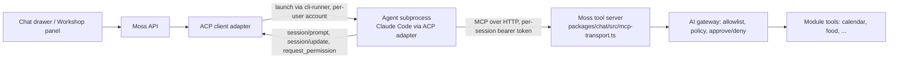

# Spec: Moss as an Agent Client Protocol (ACP) client

**Status:** Draft for review (Fitz, Muse). Decided in the "Moss Work" room on 2026-09-06 after a
for/against debate (Fable for, Foble against, Fitz facilitating, Muse researching) and a measured
spike. Build issue: to be opened once this spec is approved.

**Evidence:** `spikes/acp-tool-call/RESULTS.md` (four runs on the dev instance, 2026-09-06).
The spike code stays in `spikes/`; nothing in it ships.

**Build timing:** no code until PRs 2364 (Workshop home page), 2365 (Moss answers in a Workshop
project) and 2358 (prod chat fix) have merged. Both Workshop PRs touch the surface this spec plugs
into. Section 8 is written against 2365 and is marked accordingly.

---

## 1. Decision

Moss becomes an **ACP client**: it launches an outside coding agent (Claude Code today, others
later) as a subprocess, talks to it over the protocol's JSON-RPC-on-stdio, and hands it Moss's own
tool server at session start. Moss owns the conversation, the permissions, the tool list, and the
audit trail. The agent owns the model loop.

Two surfaces, in this order:

1. **Workshop** — the agent works on a project. Unanimous yes; the sandbox is a folder Moss
   controls.
2. **Chat** — the agent replaces today's hand-made CLI bridge (`packages/chat/src/live/`), which
   launches the Claude CLI and parses its output. Yes, with the five conditions in section 3.

Moss does **not** become an ACP agent (something other editors could host). That is a different
product and is out of scope.

## 2. Why

- Today's chat already runs a CLI subprocess and scrapes it. The bridge produced a string of real
  bugs (fenced JSON that failed to parse, a flag that silently dropped all 101 Moss tools, a
  session id mistaken for a conversation id). ACP replaces the scraping with a typed contract:
  typed content blocks, tool calls as events with ids and status, a permission request message,
  and cancel.
- The spike showed both paths pick the right Moss tool among ~100, every run, with no stray
  calls to the agent's own tools. Wall-clock is the same within noise (read: 10–18 s both arms).
- The household runs on the vendors' subscription logins through the CLIs (see
  `packages/ai/src/repository.ts`, `auth_method = 'cli'`), not per-user API keys. So the honest
  comparison was bridge versus ACP, not subprocess versus direct API call. Direct calls stay
  available through the router for API-key providers and are unaffected by this spec.
- The same session shape gives Moss a path to hosting several agents at once (section 10).

What ACP does **not** give us, stated so nobody assumes it: agents talking to each other, a
per-user vendor login, control over the agent's own system prompt, or a fix for the shared
subscription. Those stay Moss's problems.

## 3. The five conditions (requirements, not follow-ups)

1. **Workshop first, chat second.** Chat lands only after the Workshop adapter has passed the
   live-path gate.
2. **Chat launches through the per-user runner**, never from the box's login. The cli-runner
   engine host already allocates a Unix account per user (`packages/cli-runner/src/uid-allocator.ts`)
   with a scrubbed environment and its own home folder. The spike ran as the box's own login and
   inherited that login's hooks, global instructions and plugins into the Moss session. The runner is the
   fix, and the same per-account home folder is where the agent's settings file lives.
3. **Shell and file writes off in chat.** File reads, file search, web search and web fetch may
   stay on (the spike's third condition: five read-only built-ins offered, zero used on calendar
   prompts). The agent's tool list is a fixed base list, not a deny filter. In the Workshop,
   shell and writes are the point, inside the project folder.
4. **The approval card is wired to the protocol** (section 6). This is the one real defect the
   spike found, and it ships in the first slice.
5. **An agent capability list** (section 7) decides which agents may be offered on which
   surface. "Any ACP agent works with Moss" is false and the settings screen must not imply it.

Plus, stated plainly in the settings screen and in this spec: **one subscription login per agent
is shared by the whole household**, stored on disk in the runner's token store, outside the
encrypted credential store; the encrypted row for a CLI provider holds no secret at all. ACP
neither fixes nor worsens this. It is today's arrangement, carried forward knowingly.

## 4. Architecture

**Adapter.** One new package (name decided in the plan) built on the official TypeScript ACP
library, pinned to protocol v1, negotiating version at `initialize` so v2 can slot in per
connection later. It exposes one internal interface to the rest of Moss: open session, send
prompt, stream events, answer permission, cancel, close. Both surfaces use the same adapter with
different launch settings.

**Launch.** Through the cli-runner engine host, same as the bridge today: per-user account,
scrubbed environment, own home, empty scratch working folder (chat) or the project folder
(Workshop). The vendor login comes from the runner's token store via the environment. Nothing
secret ever goes on the command line (the room saw the hub leak its own tokens through `ps`).

**Tool server.** The existing MCP transport, unchanged. Moss mints the per-session bearer token
(`jst_<uuid>`, one per session, per agent) and passes it inside the `session/new` `mcpServers`
entry as an HTTP header. It travels over the stdio pipe only. Every tool call is attributable to
the token that carried it, which is how the audit trail knows which agent (and which council
seat, later) made a call. **The agent identity does not go into `AccessContext`**; that carries
only `actorUserId` and `requestId` by ruling.

**Capabilities advertised to the agent.**

| capability | chat | Workshop | why |
|---|---|---|---|
| `fs/read_text_file`, `fs/write_text_file` | no | no | v2 removes client file access; serve files as Moss tools scoped to the project folder instead, so the v2 migration does not touch file handling |
| `terminal/*` | no | no (see fork A) | same reason; commands run through a Moss tool that executes inside the sandbox |
| agent built-in shell / file-write | off | on, inside project folder | condition 3 |
| agent built-in read / search / web | on | on | spike third condition |

**Fork A — how the Workshop runs commands. Decided (review, 2026-09-06): (1).** A Moss tool runs
the command inside the project sandbox and streams output, v2-proof and audited like every other
tool. (2), advertising ACP `terminal/*`, is taken only if the slice 1 live proof shows the tool
cannot stream a build log well enough; record the reason in the plan if so.

**Conversation history.** Postgres stays the record, under row-level access. A fresh agent
session gets history replayed by Moss, the way a stateless model call does today. The agent's own
session is a cache; `session/load` is optional in the protocol and is used only when the agent
supports it and the process is still alive.

## 5. Sessions and lifecycle

- One agent process per (user, surface, conversation). Chat processes are reaped after the same
  idle timeout chat already uses for its sessions (the plan reads the existing value rather than
  inventing one). The Workshop keeps its process for the life of the project tab, and a browser
  reload is not closing the tab: reconnect to the live process if it is still up (`session/load`
  where supported), otherwise replay from Postgres.
- `session/cancel` is wired to the chat drawer's stop button and the Workshop's cancel.
- Stop reasons and errors surface to the UI as typed events, never as parsed text.
- Session ids are the agent's; conversation ids are Moss's. They are stored in separate columns
  and never substituted for one another (the 1888 lesson).

## 6. Permissions and the approval card

**The defect.** Creating a calendar event is `risk: "write"` in the calendar manifest, so the
gateway (`packages/ai/src/gateway/gateway.ts`, `confirmAndRun`) raises an approval request and
waits up to 150 s (`packages/chat/src/live/claude-permission-hook.ts`). The MCP client library
gives up after 60 s of silence (`DEFAULT_REQUEST_TIMEOUT_MSEC`). In an unattended run the agent
saw a timeout, retried once, and reported failure at 130–205 s. With an approver present the same
request finished in 16 s with exactly one event written. Not a broken tool; mismatched clocks.

**Design.**

1. While a call is held for approval, the tool server sends MCP progress notifications every
   20 s so the client's clock resets. The hold can then run the full 150 s.
2. If the hold expires or is denied, the tool reply says so in words the agent will not retry on:
   "This action was not approved. Do not retry; tell the user." The spike showed the agent
   retries a bare timeout exactly once, so the wording matters.
3. The gateway's approval request is also surfaced through ACP's `session/request_permission`
   handler, so the person sees one card in the UI whichever path raised it. The gateway remains
   the enforcement point; the protocol message is a second way to display the same card, never a
   second policy.
4. Ben's posture holds: installing a module grants normal use, only write/destructive tools ask
   at use time. The agent's own permission prompts (for its built-ins) are auto-answered from the
   same policy; anything the policy does not cover is denied.

## 7. Agent capability list

An agent may be offered on a surface only if it meets that surface's row. Checked at adapter
start, not assumed.

| requirement | chat | Workshop | Claude Code (via ACP adapter) | Gemini CLI |
|---|---|---|---|---|
| ACP v1 `initialize`, `session/new`, `session/prompt`, streaming updates, cancel | yes | yes | yes | yes |
| accepts `mcpServers` over HTTP with headers at session start | yes | yes | yes | yes |
| built-in shell and file-write tools can be switched off by the client | yes | no | yes (base tool list, confirmed in source) | no (ignores the setting) |
| runs headless with a stored login | yes | yes | yes | blocked on this box (needs interactive login) |

Result today: Claude Code on both surfaces; Gemini CLI Workshop-only, and only once it has a
login. Codex and others are added by filling in a row, not by editing code paths.

## 8. Settings, app map, and the Workshop hook (pending PR 2365)

- **Settings → AI providers** gains an "agent" choice per surface (chat, Workshop) listing only
  agents that pass section 7 for that surface, with the shared-login sentence shown beside CLI
  providers. Model choice stays with the router's picker; the sentinel `default` continues to mean
  "the agent's own account model".
- App-map entries for the new setting, the two surfaces' new behaviour, and the "not approved,
  ask the user" error are updated in the build PR (core screens in
  `packages/shared/src/app-map-core.ts`; module surfaces in the owning manifests).
- **Workshop hook:** PR 2365 makes Moss answer each saved message in a project. The ACP adapter
  replaces the answering engine behind that path; the message model, project folder and artifact
  panel stay as 2365 lands them. This section is completed after 2365 merges.
- No new required environment variable. Everything is set in the app.

## 9. Protocol version strategy

Pin v1. Negotiate at `initialize`. Known v2 changes (draft, breaking): prompt lifecycle becomes
accept-then-state-updates, client file and terminal access removed in favour of MCP tool servers,
modes folded into config options, `session/load` merged into `session/resume`, updates become
id-keyed upserts. Because this design already serves files and commands as Moss tools and keeps
Postgres as the record, the v2 migration is confined to the adapter's event handling. Tracked as
a known chore, not a surprise.

## 10. Later: several agents in one conversation

Out of scope for this build, recorded so the design does not close the door. Each extra agent is
another session with its own token; the token can carry a narrower tool list, so a "finance seat"
sees finance tools only, using the gateway's existing allowlist. Moss is the hub deciding which
seats to wake; the protocol has no agent-to-agent message. Cost scales per seat, so waking seats
selectively is the difference between a feature and a bill.

## 11. Slices and gates

1. **Adapter + Workshop.** Adapter package, launch through the runner, tool server handed in,
   Fork A resolved, approval wiring (section 6), settings + app map. Live-path proof: a real
   project, a real build command, a real approval card answered by a person on dev.
2. **Chat.** Same adapter, chat launch profile (scratch folder, writes and shell off). The old
   CLI bridge stays one release behind a setting, off by default, as the fallback; it is deleted
   after chat has passed live proof and run one clean release (review decision, 2026-09-06). Live-path proof: "add
   lunch with Sam" approved in the drawer and one event in the calendar.
3. **Gemini and others.** Only when a row in section 7 turns green on this box.

Kill gate after slice 1: if the approval wiring cannot make an attended write finish in under 30 s
end to end on dev, stop and reassess before touching chat.

## 12. Non-goals

Moss as an ACP agent; agent-to-agent messaging inside the protocol; building on v2 now; a new
credential model; per-user vendor subscriptions; a module marketplace; real OAuth callbacks.

## 13. Open questions for reviewers

1. Fork A (command execution as a Moss tool vs ACP terminal) — any reason to prefer (2)?
2. Should the bridge be deleted in slice 2 or kept one release as a fallback switch?
3. Idle-process reaping interval for chat, and whether the Workshop process survives a browser
   reload.
