# Messaging channels: Moss reaches Ben's phone, and he can reach it back

**Status:** draft, third pass 2026-09-15 after Ben's second read. Settings screen mockups
agreed with Ben on 2026-09-25 (section 9).
**Issue:** #2387. The spec merged in PR #2505.

**Design gate met.** Moss requires agreed mockups before a module is built
(DEVELOPMENT_STANDARDS, Design System Guardrails). Section 9 now carries the agreed mockups for
both settings screens.
**Author:** Claude, from the 2026-09-13 comparison of Moss with Octop.

## 1. Context

Ben reaches Moss only through a browser on his tailnet. Moss has no way to send him anything
when the browser is closed, and he has no way to ask it anything from his phone without
opening the site. The notifications package says so in its own header comment. Version one is
in-app only, with no push, email or SMS delivery. That comment is the thing this spec changes.

Three points were settled before this spec was written and are not reopened here.

- Telegram is the first platform. Creating a bot is one conversation with BotFather, the
  transport is plain HTTP, and there is no business verification and no per-message cost.
  WhatsApp would put a Meta business review between Ben and his own briefings. Discord sits in
  the middle. We build the abstraction against Telegram, ship it, and then price a second
  platform against real code.
- Outbound and inbound are separate deliverables, and outbound ships first. A briefing or a
  reminder arriving on his phone is useful before he can reply to it.
- Reaching Ben on his phone is a must-have. He said so directly.

Four more points were settled on 2026-09-15, when Ben read the first draft. They are recorded
here so they are not argued again.

- The full content goes to the phone. Approval previews carry the composed text (5.6) and
  notifications carry the whole body (5.7). Ben ruled that connecting Moss to a third-party
  tool means accepting that the content goes there. Cutting the content down would make the
  phone less useful without making Telegram see less of his life.
- Telegram is the only platform in version one. What exists for reaching other platforms
  later is recorded in 5.10, and the adapter boundary is designed so none of it needs a
  rewrite.
- Outbound ships alone first, as its own complete thing. Slice 1 (section 8) puts
  notifications on his phone with no reply path at all.
- The settings screens are Ben's to design. Section 9 describes what they must do and carries
  the mockups he agreed on 2026-09-25.

Three more points were settled later on 2026-09-15, after Ben read the second pass.

- A message sent while the assistant is still working on the last one waits in silence. No
  acknowledgement is sent. Ben's words: "I don't like the waiting in silence, but in reality you
  are sort of doing that either way, one just has a read receipt in a sense. I think we can start
  with just silence and if needed we can make changes." Recorded in 5.4.
- The instance has one shared bot by default, and a user may later supply their own bot token
  instead. Version one builds the shared bot only, but the tables are keyed per bot from the
  start so that adding a user's own bot later needs no change to an applied migration. Recorded
  in 5.11, with the reasoning and the exposure the shared bot carries.
- Group chats are an explicit non-goal for version one, not a side effect of the private-chat
  check. Recorded in section 3.

## 2. Goals

- Ben links his phone to his Moss account from Settings in under a minute, and the link is
  proved, not guessed.
- Every notification Moss would show him in the app also arrives in his Telegram chat, with
  quiet hours respected the same way the app respects them.
- He can message the bot from his phone and get the same assistant he gets in the browser
  drawer, with the same tools, the same memory, and the same approval rules.
- When the assistant needs a yes or no before acting, he can give it from the phone.
- Nothing about this needs a hand-edited settings file. The bot token is pasted into a screen
  and stored encrypted.
- A second platform later is a new adapter file plus a new value in one list, not a redesign.
  The boundary is the deliverable; 5.9 says what it must not assume about Telegram.

## 3. Non-goals (v1)

- WhatsApp, Discord, Signal, iMessage, SMS, email. The adapter boundary is shaped for them;
  none is built. Off-the-shelf routes to them (Apprise for sending, Matrix bridges for
  conversations) are recorded in 5.10 and not adopted.
- Group chats. This is a deliberate exclusion, decided 2026-09-15, not a side effect of the
  private-chat check. Only a private chat between one person and the bot is linked, so Moss
  cannot sit in a shared family chat and talk to several people at once. The bot refuses to
  join groups (BotFather setting, see 7.1) and the receiver drops any update whose chat is not
  private. Ben has not asked for group chats. Adding them later would take a binding per group
  keyed by the group's chat id, the reserved `telegram-group` surface (5.2), the BotFather
  group setting reversed, and a rule for whose account the assistant acts as when several
  linked people share one room. That last rule is the hard part, because tools and memory are
  owner-only and one reply cannot read two people's data.
- A user's own bot token. Version one uses the shared instance bot only. The tables are keyed
  per bot so that a user's own bot can be added later without touching an applied migration
  (5.11).
- Photos, files and voice notes in either direction. An inbound attachment gets one sentence
  saying the phone chat is text only.
- Private (incognito) sessions over the phone. The drawer's private mode stays a drawer feature.
- Streaming partial answers. The phone gets one message per completed reply.
- Reaching a user who has not linked a phone. There is no broadcast, no send-to-anyone.
- A Telegram webhook. Version one polls (section 5.4). Webhook support is a later option for
  installs that have a public address.
- Admin visibility into other users' linked chats or messages. Admin power stays configuration
  power, which here means the bot token and nothing else.

## 4. A new built-in module, with one small seam in notifications

This is a new built-in module, `channels`, in `packages/channels`. It owns the bot connection,
the phone-to-account bindings, the Telegram adapter, the receiver, the inbound queue and its
handler, the outbound send, and the settings screens. It is not an extension of the notifications package or the chat package.

Reasons.

- The feature straddles both packages. Outbound is notification delivery; inbound is a chat
  surface. Putting it in either one would make that package import the other's internals,
  which the module isolation rule forbids.
- The binding table, the link-code flow, the bot token and the receiver belong to neither
  notifications nor chat. They are the channel's own state.
- A second platform lands as one adapter inside this module and touches nothing else.

Two existing packages change, each at one declared seam.

- Notifications gains a delivery fan-out. When a notification row is created, notifications
  enqueues one metadata-only job, and the worker hands the row to every registered delivery
  target inside the recipient's data context. Web push (#743, spec 2026-09-04) is the other
  target and should use the same fan-out; whichever ships first builds it. The header comment
  in the notifications package changes from "no external delivery" to "in-app creation, owner
  only, with delivery targets that fan out from the created row". The creation rules do not
  change. A notification is still a personal row created inside the recipient's own scope.
- Chat gains nothing new in its schema. The channels module calls the chat session manager's
  existing public methods (ensure a session, submit a turn, subscribe to the transcript,
  inject a record) with a new surface value. See 5.2 for why the surface type needs no change.

## 5. Design

### 5.1 The pieces

| Piece             | Where it runs             | What it does                                                                                                                                                                                                            |
| ----------------- | ------------------------- | ----------------------------------------------------------------------------------------------------------------------------------------------------------------------------------------------------------------------- |
| Bot connection    | API, settings route       | Admin pastes the BotFather token. Moss verifies it with one call, stores it encrypted, shows "Connected as @name".                                                                                                      |
| Link codes        | API, settings route       | A signed-in user asks for a code. Moss stores its hash with the user id and a ten-minute expiry.                                                                                                                        |
| Receiver          | API process, one instance | Long-polls Telegram for new messages and button presses. Resolves each to a bound user or to "unknown", redeems link codes, answers strangers, and puts everything else on the inbound queue. Holds no assistant state. |
| Inbound queue     | Postgres (pg-boss)        | One job per inbound message or button press. Carries ids only (5.4). The message text waits in an owner-only holding row until the handler takes it.                                                                    |
| Inbound handler   | API process               | Works the inbound queue. Runs the bound user's chat turn on the `telegram` surface, or resolves a button press, and sends the reply back.                                                                               |
| Approval cards    | API process               | Renders a pending action request as a message with Approve and Deny buttons; a button press resolves it through the existing resolve path.                                                                              |
| Outbound delivery | Worker                    | A registered notification delivery target. Loads the notification inside the recipient's data context and sends it to each linked chat.                                                                                 |
| Settings screens  | Web                       | Admin connects the bot. Each user links and unlinks phones. Section 9.                                                                                                                                                  |

### 5.2 A Telegram chat is a chat surface

Every live conversation in Moss already carries a surface value, and every thread query filters
on it. The drawer is `drawer`. A Telegram private chat becomes `telegram`. The session key is
then user id plus `telegram`, exactly as the drawer's is user id plus `drawer`, so memory,
tools, settings and the approval flow all come along unchanged.

The surface value cannot carry the Telegram chat id, and it does not need to. The surface
column is constrained to a short lowercase word (up to 32 characters, letters, digits and
hyphens) and every thread query filters on it, so a platform id does not belong there. The chat
id lives in the binding row (5.3), which maps chat id to user. One user has at most one bound
Telegram chat in v1, so user id plus `telegram` names the conversation without ambiguity. If
groups ever arrive, the group chat id also lives in a binding row and the surface becomes
`telegram-group`; the thread schema still does not change.

Octop keys its sessions as agent, channel kind, platform session and direct-or-group. Moss
already has the first two (the actor and the surface) and keeps the platform session in the
binding, not the key.

### 5.3 Data (channels module SQL, new files under `packages/channels/sql/`)

Every table below hangs off a bot row, not off the platform. Version one has exactly one bot
row, the shared instance bot. The keying is chosen now because an applied migration can never
be edited, and a user's own bot later (5.11) would otherwise force a primary-key change.

```sql
CREATE TABLE app.channel_bots (
  id uuid PRIMARY KEY,
  platform text NOT NULL CHECK (platform IN ('telegram')),
  platform_bot_id text NOT NULL,         -- the bot's own id on the platform (Telegram getMe)
  username text NOT NULL,                -- shown in Settings and used to build the deep link
  owner_user_id uuid REFERENCES app.users(id) ON DELETE CASCADE,
                                         -- null = the shared instance bot; set = a user's own bot (not built in v1)
  created_at timestamptz NOT NULL DEFAULT now(),
  disabled_at timestamptz,               -- set on Disconnect; the row stays so bindings can say why they stopped
  UNIQUE (platform, platform_bot_id)     -- one bot may be registered once; two pollers on one token conflict
);

CREATE TABLE app.channel_bindings (
  id uuid PRIMARY KEY,
  owner_user_id uuid NOT NULL REFERENCES app.users(id) ON DELETE CASCADE,
  bot_id uuid NOT NULL REFERENCES app.channel_bots(id) ON DELETE CASCADE,
  platform_chat_id text NOT NULL,
  platform_sender_id text NOT NULL,
  display_name text NOT NULL,            -- Telegram first name, shown in Settings only
  deliver_notifications boolean NOT NULL DEFAULT true,
  created_at timestamptz NOT NULL DEFAULT now(),
  last_inbound_at timestamptz,
  last_outbound_at timestamptz,
  failure_count integer NOT NULL DEFAULT 0,
  disabled_at timestamptz,
  UNIQUE (bot_id, platform_chat_id)      -- a chat id is only meaningful for the bot that sees it
);

CREATE TABLE app.channel_link_codes (
  id uuid PRIMARY KEY,
  owner_user_id uuid NOT NULL REFERENCES app.users(id) ON DELETE CASCADE,
  bot_id uuid NOT NULL REFERENCES app.channel_bots(id) ON DELETE CASCADE,
                                         -- the bot this code may be redeemed through
  code_hash text NOT NULL UNIQUE,        -- sha256 of the code; the code itself is never stored
  expires_at timestamptz NOT NULL,
  consumed_at timestamptz,
  created_at timestamptz NOT NULL DEFAULT now()
);

CREATE TABLE app.channel_poll_state (
  bot_id uuid PRIMARY KEY REFERENCES app.channel_bots(id) ON DELETE CASCADE,
  last_update_id bigint NOT NULL,
  updated_at timestamptz NOT NULL DEFAULT now()
);

CREATE TABLE app.channel_inbound_messages (
  id uuid PRIMARY KEY,
  owner_user_id uuid NOT NULL REFERENCES app.users(id) ON DELETE CASCADE,
  binding_id uuid NOT NULL REFERENCES app.channel_bindings(id) ON DELETE CASCADE,
  kind text NOT NULL CHECK (kind IN ('text', 'button', 'unsupported')),
  text text,                             -- the message body; null for button and unsupported
  platform_message_id text,              -- the message a button press belongs to, for editing the card
  received_at timestamptz NOT NULL DEFAULT now(),
  handled_at timestamptz                 -- set by the handler; rows are deleted after handling
);
```

Row-level security.

- `channel_bots` holds no secret. The token lives in the encrypted settings store (5.8), and
  the row only says which bot exists and who owns it. Rows with a null owner (the shared
  instance bot) are readable by every app-role user, because Settings needs the username to
  show "Connected as" and to build the link. Rows with an owner are owner-only. Only an admin
  writes the instance row; a user would write their own row later. Worker role gets SELECT.
- `channel_bindings` and `channel_link_codes` are owner-only for the app role. The worker
  role gets SELECT on bindings plus UPDATE of the counters and `disabled_at`, mirroring the
  notification_reads worker grant (0166) and the web push subscriptions plan.
- `channel_poll_state` holds no user data, only a position in Telegram's update stream. App
  role read and write.
- `channel_inbound_messages` is owner-only for the app role, written by the receiver inside
  the resolved owner's data context and read and deleted by the handler inside the same
  context. Rows live for seconds. Anything older than one hour and unhandled is deleted by
  the handler on its next pass, and the sender gets "Moss missed that message, please send it
  again."
- A binding row never holds message text. The holding table above is the one place in this
  module that does, and only between receipt and handling. Once handled, the message lives
  in the user's chat thread and nowhere else. This is a change from the first draft, which
  handled the message in the poller and never stored it outside the thread; 5.4 says why.

Two functions run before any actor exists, because an inbound Telegram update arrives with no
session. Both are `SECURITY DEFINER`, revoked from public, granted to the app runtime role
only, and return exactly one thing, the owner's user id or null. This is the same shape the
chat package uses for its incognito cleanup function (migration 0174). Everything after that
lookup runs inside the returned actor's normal data context.

```sql
app.resolve_channel_binding(p_bot_id uuid, p_chat_id text, p_sender_id text) RETURNS uuid
  -- owner_user_id of the active binding for this bot where chat id AND sender id both
  -- match, else null

app.redeem_channel_link_code(p_bot_id uuid, p_code_hash text, p_chat_id text,
                             p_sender_id text, p_display_name text) RETURNS uuid
  -- atomically: find an unexpired, unconsumed code by hash whose bot_id matches; mark it
  -- consumed; insert the binding (or re-activate one for the same bot and chat); return
  -- owner_user_id. Null on any miss, including a code issued for a different bot.
```

Both take the bot's row id rather than the platform name. The receiver that saw the update
knows which bot it is polling for, and the platform follows from the bot row. A code issued
for one bot cannot be redeemed through another, so a user's own bot later cannot be bypassed
by typing that user's code into the shared bot.

This is the one place on the path that reads across users, and it is limited to answering
"whose chat is this". It is not an admin bypass and no role gains BYPASSRLS.

### 5.4 Receiving: one thin receiver, then a queue

Ben's instance has no public address, so Telegram cannot call a webhook on it. Telegram's
other delivery mode is long polling, where the bot asks Telegram for new updates and Telegram
holds the request open until something arrives. That needs only outbound internet, which the
instance already has for search and connectors.

Sending and receiving have different limits, and the difference decides the shape below.

- Sending has no single-consumer limit. A Telegram message is one HTTPS call, and any Moss
  process can make it. The worker sends notifications (5.7), the API process sends replies,
  and nothing coordinates them. Future outbound features are not constrained by anything in
  this section.
- Receiving by long polling is single-consumer, per bot token. Telegram answers a second
  poller with a conflict error (409, "terminated by other getUpdates request"). That is
  Telegram's rule, not a Moss choice, and it is the only place a lock is needed.

The receiver does as little as possible, so the lock covers as little as possible.

- The receiver pulls a batch of updates, and for each one resolves the sender through
  `resolve_channel_binding`. A `/start` with a code is redeemed on the spot (5.5), because
  that is a lookup and needs no assistant. An unknown sender gets the one fixed sentence (7)
  and nothing is stored. Everything else from a bound chat is written to
  `channel_inbound_messages` inside the owner's data context, and one job is put on the
  inbound queue.
- The job payload is `{ actorUserId, bindingId, inboundMessageId, kind }` and nothing else.
  The message text stays in the holding row. This keeps the metadata-only job payload rule,
  which forbids private content in a queue payload. It is the reason the holding table
  exists. The first draft never queued a message, so the question did not arise.
- The poll state row for the bot advances (`last_update_id`) once the batch's rows and jobs
  are written, so a restart neither replays a message nor loses one that was accepted.
  Update ids are Telegram's counter for one bot, so the position is stored per bot row, not
  per platform. Under the earlier per-platform key, connecting a different bot would have
  handed the old bot's position to the new one and silently skipped its first messages.
- The receiver takes a Postgres advisory lock at start, keyed on the bot row id. A second API
  process logs "another process holds the Telegram receiver lock" and does not poll. A 409
  from Telegram is treated the same way and retried with backoff.
- The receiver starts only when a bot token is stored. Removing the token stops it. A missing
  token degrades this module and nothing else.
- One receiver loop, one lock and one poll state row per active bot row. Version one has one
  bot row, so one loop. When a user's own bot exists later (5.11), the API process runs a
  second loop for it with its own lock and its own position, and the two never share a
  request, because Telegram's single-poller rule is per token. That is the whole shape of
  the later work on the receiving side. It is not built now.

The inbound handler is separate code, downstream of the queue.

- It works the inbound queue in the API process, because that is the only process hosting
  the live assistant with its tools and approval cards. This is the first queue the API
  process consumes; today it only enqueues. The same registration helper the worker uses
  for a data-context job applies unchanged.
- One job at a time per user. A message that arrives while that user's turn is in flight
  waits in the queue and is retried after the turn completes, instead of being refused. Only
  if it has waited more than two minutes does the bot say "Still working on your last
  message."
- The queued message gets no acknowledgement. Ben settled this on 2026-09-15: "I don't like
  the waiting in silence, but in reality you are sort of doing that either way, one just has
  a read receipt in a sense. I think we can start with just silence and if needed we can make
  changes." The reasoning is that a "got it, still working" line would not shorten the wait,
  only confirm it, and the browser drawer gives no such line either. The two-minute line
  above stays, because it signals a stuck turn rather than a normal wait. If silence turns
  out to annoy him in use, adding an immediate acknowledgement is one extra send in the
  handler when it finds a turn in flight, and no table or contract changes.
- After handling, the holding row is deleted.

What this buys, and what it does not.

- The lock now covers a receiver that only reads and writes rows. It no longer covers the
  assistant. A slow turn cannot stall the poll, a crash mid-turn cannot lose a message that
  was already accepted, and the receiver can be moved or replaced (a webhook route, a
  separate process) without touching how turns run.
- The assistant session holds state in memory and still lives in the API process, so a
  queued message is still handled there. The API process still matters. A dedicated receiver
  process would only pay for itself when more than one API instance runs, and Moss runs one,
  so it is not added.
- Webhooks are a later option for internet-facing installs. The adapter exposes one
  `handleUpdate` entry that both the receiver and a webhook route call, so switching is a
  transport change, not a logic change. That entry does not change in this revision.

### 5.5 Binding a phone to an account

Anyone who finds the bot can message it, so the binding must be proved by something only the
signed-in user has.

1. In Settings, the signed-in user presses "Link a phone". Moss generates a 10-character code
   from an unambiguous alphabet, stores its hash with the user id and a ten-minute expiry, and
   shows the code plus a `https://t.me/<bot>?start=<code>` link.
2. The user opens the link on the phone, or types `/start <code>` to the bot.
3. The receiver sees a `/start` from a chat with no binding. It hashes the payload and calls
   `redeem_channel_link_code`. The binding is created only if the chat is a private chat and
   the sender id equals the chat id, which is how Telegram represents a direct conversation.
4. The bot replies "Linked to your Moss account. Notifications will arrive here." The Settings
   screen flips from "waiting for your message" to the linked chat's row.

Limits.

- One pending code per user at a time; asking again replaces it.
- Five failed redemptions from one chat id in an hour, and that chat is ignored for an hour.
  The bot does not say whether a code was wrong or expired. The Settings screen carries the
  diagnosis ("code expired, make a new one"), because that screen is only visible to the
  account owner.
- Every later inbound message is matched on chat id and sender id together. A message from a
  bound chat but a different sender is treated as unknown.
- Unlink is one action in Settings and deletes the binding. Deleting the account cascades.
- A rebinding of the same chat by a different user's code moves the binding. The old owner
  sees it vanish from Settings. This is the correct outcome, because the code proves who holds
  the phone now.

### 5.6 What an inbound message may do

The rule is the same as the drawer's, because it is the same session. Installing a module
grants normal use; write actions run or ask according to their family's tier; destructive
actions always ask. Nothing about arriving by Telegram widens or narrows that.

- Text reaches the handler through the queue (5.4) and goes to `submitTurn` on the user's
  `telegram` session. The reply record's text is sent back as one Telegram message; the
  adapter splits it at Telegram's 4096-character limit.
- A tool call that needs approval already produces a durable action request row and a
  transcript record naming it. On the phone that record becomes a message carrying the
  action's label and its key-names-only summary, with two inline buttons, Approve and Deny.
  The button's callback data is the action request id and nothing else.
- A button press is queued like a message, with the action request id and the card's
  message id in the holding row, and resolves the request through the same resolve path the
  web uses, as the bound actor. The action request row is owner-only, so a press from any other chat cannot
  touch it even if the id were guessed. The button message is edited to "Approved" or
  "Denied" so it cannot be pressed twice.
- The existing stale-request cancellation (migration 0098) applies unchanged. A card left
  alone expires the way it does in the drawer, and the bot edits the message to "Expired".
- A rich preview, which the drawer shows for some tools such as email replies, is included in
  the approval message, capped at 1500 characters. Approving an email blind is worse than
  letting the composed text pass through Telegram. Ben confirmed this on 2026-09-15
  (section 1).
- A `/start` with no code from a bound chat replies with a one-line greeting. Other slash
  commands are not defined in v1; the text goes to the assistant like any other message.
- No configured chat model gets the fixed reply "Moss has no assistant model set up. Open
  Settings, Assistant & AI." A message that arrives during a turn waits its turn (5.4) and
  only says "Still working on your last message" after two minutes.

### 5.7 Outbound: notifications arrive on the phone

- Notifications enqueues `notifications.deliver` with `{ notificationId, recipientUserId }`
  when a row is created with no deferral, and `notifications.deliver.summary` with
  `{ recipientUserId, releaseAt }` (singleton per recipient and release time) when quiet
  hours defer it. Both payloads are ids and a timestamp. No text, no secrets.
- The channels delivery target runs inside the recipient's data context, reads the
  notification and the recipient's active bindings with `deliver_notifications` on, and sends
  one message per binding, through the bot that binding belongs to. In version one that is
  always the instance bot, whose token the worker loads from the instance settings store. A
  user's own bot later (5.11) would have its token loaded inside that same recipient context,
  and this loop would not change. The message is the title in bold, the full body capped at 3500
  characters, and, when the instance has a Moss address set (5.8), a link to the
  notification's screen. Telegram carries far more than a push tray, so the body goes whole.
  Ben confirmed the whole body on 2026-09-15 (section 1).
- The worker sends directly. Sending needs no lock and no receiver (5.4), so outbound
  delivery works even while the receiver is stopped or held by another process.
- Quiet hours produce one summary at release time, "N notifications while you were away",
  with a link to the notifications screen. Urgent notifications are never deferred today and
  go straight out. This matches the web push decision Ben already made.
- The delivered text is also appended to the user's `telegram` thread as an assistant message,
  so a reply from the phone ("what's this one about?") has the context it refers to. The
  build plan must confirm the live session picks up a message persisted while it was idle;
  if it does not, the handler injects the record when the session is next ensured.
- Telegram refusing with "bot was blocked by the user" (403) disables the binding and the
  Settings row reads "Not reachable, unlink and link again". Other failures increment the
  counter, five in a row disable, and a success resets it.

### 5.8 Bot token and the Moss address

- The instance bot token is an instance secret, key `channels.telegram.bot_token`, marked
  secret in the instance settings registry so the generic settings routes reject it, and
  written only by the dedicated encrypted route. It is stored with the same envelope the
  Brave search key uses and loaded lazily through the master key store pattern (spec
  2026-09-05). Missing means this module shows "needs attention" and nothing else breaks. No
  env var is added.
- The token is never written to the `channel_bots` table. The bots row tells the code which
  store to read the token from (a null owner means the instance settings store; an owner id
  would later mean that user's own encrypted credential row), and nothing more. A table every
  user can read must not carry a secret, even an encrypted one.
- On save, Moss calls `getMe` once and writes the bot's id and username into the
  `channel_bots` row, so Settings can show "Connected as @name" and build the link URL
  without touching the token again. Saving the same bot again (same id from `getMe`) clears
  `disabled_at` on the existing row and keeps every binding. Saving a different bot inserts a
  new row, and bindings on the old row keep showing "bot disconnected", because Telegram will
  not let a bot message a person who has never started a chat with it. Those users link
  again.
- Disconnect deletes the token from the settings store and sets `disabled_at` on the bot
  row. The row and its poll position stay, so reconnecting the same bot within Telegram's
  24-hour update retention loses nothing.
- The Moss address for links is an optional non-secret instance setting on the same admin
  screen. Blank means messages carry no link. Nothing requires it.

### 5.9 Adapter boundary

One TypeScript interface, one implementation in v1. The boundary is the deliverable. It is
shaped so that Matrix (5.10) or any other platform lands as a second file behind it, so it
must not bake in things that are true of Telegram and false elsewhere.

```ts
type ChannelPlatform = "telegram"; // the one list a second platform adds to

interface ChannelCapabilities {
  readonly maxTextLength: number; // adapter splits at this; callers never do
  readonly inlineButtons: boolean; // false: approval cards fall back to "reply approve or deny"
  readonly editSentMessage: boolean; // false: state changes are sent as a new message
}

interface ChannelAdapter {
  readonly platform: ChannelPlatform;
  readonly capabilities: ChannelCapabilities;
  sendText(chatId: string, text: string, opts?: { buttons?: ApprovalButtons }): Promise<SendResult>;
  editApprovalState(
    chatId: string,
    messageId: string,
    state: "approved" | "denied" | "expired"
  ): Promise<void>; // no-op when capabilities.editSentMessage is false
  handleUpdate(raw: unknown): Promise<readonly InboundEvent[]>; // one entry, called by poller or webhook
  start(handle: (event: InboundEvent) => Promise<void>): Promise<void>; // long polling; a webhook install calls handleUpdate instead
  stop(): Promise<void>;
}

type InboundEvent =
  | {
      kind: "text";
      chatId: string;
      senderId: string;
      chatType: "private" | "group";
      text: string;
      displayName: string;
    }
  | { kind: "button"; chatId: string; senderId: string; messageId: string; data: string }
  | { kind: "unsupported"; chatId: string; senderId: string };
```

Everything above the adapter (binding, receiver, queue, handler, approvals, delivery) is
platform-neutral. The `platform` check constraint in SQL and the `ChannelPlatform` type are
the one list a second platform adds to.

What the code above the adapter must not assume, because it is Telegram-shaped.

- Message length. Telegram allows 4096 characters; Matrix has a much larger event size
  limit, SMS has 160. The adapter owns splitting and reports its limit in `capabilities`.
  Nothing above it hard-codes 4096 or 3500; the notification body cap in 5.7 is expressed as
  "leave room for the title and link under the adapter's limit".
- Inline buttons. Telegram has them; Matrix has no standard equivalent, and SMS has none. The
  approval flow renders buttons when the adapter says it can and otherwise sends the same
  card with "Reply approve or deny" and treats the next short reply as the answer. The
  callback data is the action request id either way.
- Editing a sent message. Telegram can edit its own messages in place; some platforms cannot,
  or can only within a time window. When editing is unavailable the "Approved", "Denied" and
  "Expired" states are sent as a new message.
- One user, one chat. The binding table already allows several bindings per user and the
  delivery target already loops over them. Nothing above the adapter may look up "the" chat
  for a user. The session key stays user plus surface (5.2), so several bound chats on one
  platform share one conversation.
- Sender id equals chat id. That is how Telegram represents a private chat. Other platforms
  give a room id and a separate user id. The private-chat check in 5.5 belongs to the
  Telegram adapter, which reports `chatType`; the redemption function only requires that the
  adapter said "private".
- Update ids and polling. `channel_poll_state` is keyed by bot row and its column is a
  Telegram-shaped integer. A second adapter that syncs by token gets its own column or its
  own row shape; the receiver loop is written per adapter and per bot, and the queue below it
  does not care.
- Chat ids are opaque strings. Telegram's are integers; Matrix room ids look like
  `!abc:server`. Nothing parses them.

### 5.10 Other platforms: what exists off the shelf

Ben asked on 2026-09-15 whether existing tools could reach more platforms so Moss does not
write adapters from scratch. The answer, checked against each project's own documentation
on 2026-09-15, is that sending is solved off the shelf and conversing mostly is not. Neither
is adopted now. The design above is checked against both so that neither needs a rewrite.

Sending to many platforms is a solved problem, and Apprise solves it.

- Apprise (github.com/caronc/apprise) is a Python library and command-line tool that sends a
  notification to more than 150 services behind one address syntax. Telegram, Discord,
  Slack, Signal, ntfy, Matrix, email and around forty SMS gateways are all in its list.
  Signal through Apprise still needs a separate Signal service running; Apprise only knows
  how to talk to it.
- It is Python, so it does not link into Moss. Its companion, apprise-api, is a small REST
  service shipped as a Docker image, and Moss would call it with one HTTP request per
  notification. That is one extra container in the compose file and no new code in Moss
  beyond a delivery target.
- If it is adopted later, it arrives as one more registered delivery target in the
  notifications fan-out (section 4), next to the Telegram target and web push. The fan-out
  already loops over registered targets inside the recipient's data context, so nothing
  above it changes. Which Apprise addresses a user has would be that user's own settings,
  owner-only.
- It is not version one. Telegram alone answers Ben's must-have, and one container fewer is
  one thing fewer to operate.

Novu is the TypeScript-native option for the same job, and Moss rejects it.

- Novu (github.com/novuhq/novu) is a whole notification product, with its own workflow
  engine, digest engine, subscriber and preference model, an embeddable inbox component and
  its own database. It counts twenty email, thirty-seven SMS, eight push and thirteen chat
  providers.
- Moss already has a notifications package with row-level security around every row, quiet
  hours, and a digest. Adopting Novu means replacing working code and its security model to
  gain platforms that Apprise reaches for the price of one container. It is a product to run
  alongside Moss, not a library to call.

Conversations on many platforms have one real answer, Matrix with the mautrix bridges.

- Matrix is an open chat protocol. The mautrix bridges (docs.mau.fi/bridges/go/setup.html)
  are Go programs that connect a Matrix homeserver to WhatsApp, Signal, Telegram, Discord,
  Slack, Google Messages, Instagram, LinkedIn and others. Write a Matrix adapter once and
  every bridged platform arrives through it, in both directions.
- The cost is a second system to operate. It needs a Matrix homeserver that supports
  application services (Synapse is the usual one), a Postgres database per bridge (a shared
  server is fine, a shared database is not), and one Go container per bridged platform. The
  WhatsApp bridge logs in as a linked device by scanning a QR code with the real WhatsApp app
  on a phone, and that phone must come online at least every two weeks or the link drops. The
  Signal bridge links the same way.
- Revisit only if Moss genuinely needs conversations on WhatsApp or Signal. For Discord or
  Slack a direct adapter is cheaper than a homeserver.
- If it is adopted later, it arrives as one more adapter behind the boundary in 5.9, with
  `platform` set to `matrix`. The Telegram-shaped assumptions listed there are the ones that
  would break it: Matrix has no inline buttons, edits are a different event, a room is not a
  user, and the room id is not a number. The boundary is written so that none of those reach
  the code above it.

### 5.11 Shared bot by default, a user's own bot token later

Ben asked on 2026-09-15 how several users on one instance are routed. The answer above does
not change. One instance bot, one binding per chat, chat id and sender id both matched, one
lookup that returns only an owner id. His instance has no other human users today, but he
said it could have them today if he wanted, so this is a live question rather than a
hypothetical one. What he ruled is that the shared bot stays the default and a user may
optionally supply their own bot token instead. Version one builds the shared bot only.

Why the shared bot is the default.

- Creating a bot means messaging BotFather, running /newbot, inventing a globally unique
  username ending in "bot" (which usually takes several tries), then copying a long secret
  into Moss. Moss assumes one technical person runs the instance for people who do not want
  to think about it. Making every user do that pushes setup onto the people least equipped
  for it.
- One bot means one place to check that hygiene settings are right (7.1), one receiver to
  keep alive, and one thing for the admin to fix when Telegram rejects a token.

What the shared bot costs, stated plainly.

- The bot token is held by the admin and carries every user's private messages, in both
  directions. Moss is strict that admin power is configuration power only and that row-level
  security applies to admins too. This is the first thing in the system where an admin-held
  secret sits in front of other users' private content. The database never lets the admin
  read another user's messages; the bot token does.
- It fails worse than a stolen database would. Whoever holds the token can run their own
  poller from anywhere on the internet, win the race against the instance for each batch of
  updates, and silently intercept every user's inbound messages from then on, with no further
  access to the box. A stolen database is a copy of the past. A stolen bot token is an
  ongoing tap, and the instance's only symptom is a 409 conflict it already expects to see.
- A user's own bot token removes both exposures for that user. Their messages then pass
  through a bot only they hold, and the admin cannot read them or tap them.

What version one does to keep that option open, since an applied migration can never be
edited.

- A `channel_bots` table exists from the first migration, with an owner column that is null
  for the instance bot. The token is not in it (5.8).
- Poll position is keyed by bot row, not by platform. This is the change that would otherwise
  have forced a primary-key migration, and it also fixes the different-bot rotation bug noted
  in 5.4.
- Bindings and link codes carry the bot row id. A chat id is only meaningful for the bot that
  sees it, so the uniqueness rule is per bot and chat, and a code can only be redeemed through
  the bot it was issued for.
- The two lookup functions take the bot row id, not the platform name.
- The receiver is written as one loop per active bot row, with one lock and one poll state
  row each, and the delivery loop sends through each binding's own bot. With one bot row that
  is exactly the version-one behaviour.

What the later work would add, and is not built now.

- A user-scope encrypted credential row for the user's own token, in the existing
  module-credential key family, and a route to save and revoke it.
- A second receiver loop for that bot in the API process, started and stopped with the token
  the same way the instance loop is.
- A "use my own bot" path on the user's Messaging screen (section 9), with the same BotFather
  hygiene advice the admin screen gives.
- A rule for a user who has both. The simplest is that the user's own bot replaces the
  instance bot for that user, so their bindings move to it and the instance bot treats them
  as a stranger from then on.

## 6. Security invariants on this path

- **No admin bypass.** The two definer functions answer "whose chat is this" and nothing more.
  Every read and write after that runs as the bound actor under normal row-level security.
  Admins configure the bot; they cannot see anyone's bindings or messages.
- **Private by default.** Bindings, codes, threads and action requests are owner-only rows.
- **Secrets never escape.** The bot token is encrypted at rest, loaded lazily, never logged,
  never in a job payload, never in an export, never in a prompt, and never returned by any
  route. The settings route returns presence and the bot username only. The assistant's reply
  pipeline is the drawer's pipeline, so whatever filtering the drawer applies to notes and tool output
  apply to what reaches the phone.
- **Metadata-only job payloads.** Outbound jobs carry ids and a timestamp (5.7). Inbound
  jobs carry the actor id, the binding id, the holding row id and the kind (5.4). Message
  text is never in a payload.
- **Same actor rules.** The inbound actor is the binding's owner, established by the proof in
  5.5, and enters the same data context the browser session would. Tool permissions and
  action-family tiers are read from that user's settings.
- **What Telegram sees.** Telegram bot chats are not end-to-end encrypted. Notification text,
  assistant replies and approval previews pass through Telegram's servers in the clear, the
  same way web push text is visible in a device tray. Ben accepted that trade for push. It is
  restated here so it is a decision, not a surprise.
- **Known exposure of the shared bot.** The instance bot token is an admin-held secret that
  every user's messages pass through, and a stolen token is an ongoing tap on inbound
  messages from anywhere, not a copy of past data (5.11). This is the one place on the path
  where the "admin power is configuration power only" rule does not hold, and it is accepted
  for version one because the shared bot is what makes setup possible for non-technical
  users. A user's own bot token, when built, removes the exposure for that user. Until then
  the admin screen says so in one line.
- **Logs.** The receiver and the handler log update ids, job ids and binding ids, never
  chat ids, sender ids, or message text. Unknown-sender events log a count, not an id.
- **Export.** A user's data export includes their binding metadata (platform, display name,
  linked date) and nothing from the codes table.

## 7. Unknown senders

An unknown sender gets one fixed sentence, then silence.

- First message from an unbound chat in any 24-hour window gets "This assistant is private.
  If it is yours, link it from Moss Settings." Later messages in the window get nothing. The
  window is kept in the receiver's memory; a restart resets it, which is harmless.
- The sentence names no owner, no instance address and no product detail beyond the word
  Moss. It does not reveal whether a code was tried or was wrong.
- Silence was rejected because Ben will message the bot before linking at least once, and a
  bot that says nothing is indistinguishable from a broken one. One sentence per day gives
  him the next step and gives a stranger nothing to work with.
- The `/start` deep link with an invalid code is treated as an unknown sender. The Settings
  screen, visible only to the account owner, is where a failed link is explained.

### 7.1 Bot hygiene the admin screen asks for

The admin screen tells whoever creates the bot to run two BotFather commands, and explains
why in one line each. `/setjoingroups` Disable, so the bot cannot be added to a group. Group
privacy left on (the default), so even in a group it would not see ordinary messages. Moss
also refuses any update whose chat type is not private, so the settings are belt and braces.

## 8. Slices

Slice 1 builds both settings screens from the agreed mockups in section 9.

Outbound ships alone first. Ben called that ideal on 2026-09-15, and slice 1 is a complete,
shippable thing with no reply path at all.

1. **Outbound: notifications reach the phone.** Bot token screen, encrypted storage, `getMe`,
   link codes, the receiver handling only `/start`, binding redemption, the linked
   confirmation message, unlink, the unknown-sender reply, the notifications fan-out job, the
   channels delivery target, quiet-hours summary, failure handling, the thread append, the
   per-binding "deliver notifications" switch, app map, settings screens. After this slice
   Ben's briefings and reminders arrive on his phone. Any other message he sends the bot gets
   one fixed sentence, "Replies are not on yet; notifications only for now."
2. **Inbound: talk to the assistant from the phone.** The holding table, the inbound queue
   and the API-side handler, text to `submitTurn`, reply back, approval buttons, resolve,
   expiry edits, the no-model and waiting replies, attachment refusal.

Each slice is its own pull request series with its own live-path proof. Slice 1 proves
through receipt; slice 2 proves through an approval.

## 9. Settings screens

Ben agreed these mockups on 2026-09-25. They are built from the live settings markup
(`pane__card`, `set-row`, `fld`, `jds-*` primitives) and captured on the dark theme. The
requirements under each screen still bind; the mockups show how each one reads.

Admin screen, "Messaging bot" (admin scope). It sits in the admin settings under
"AI & extensions", after "Instance modules".

| State                                   | Mockup                                                        |
| --------------------------------------- | ------------------------------------------------------------- |
| Not connected (`Stopped, no token`)     | 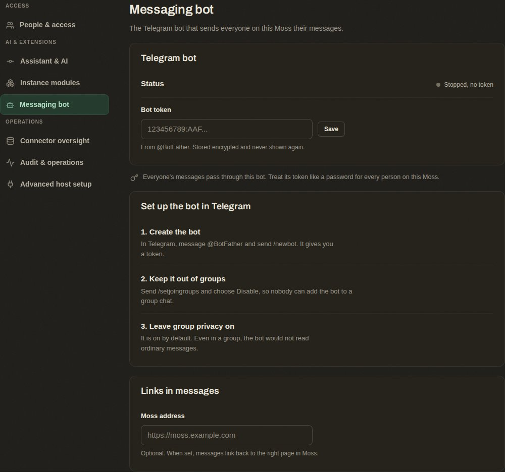     |
| Token rejected on save                  | 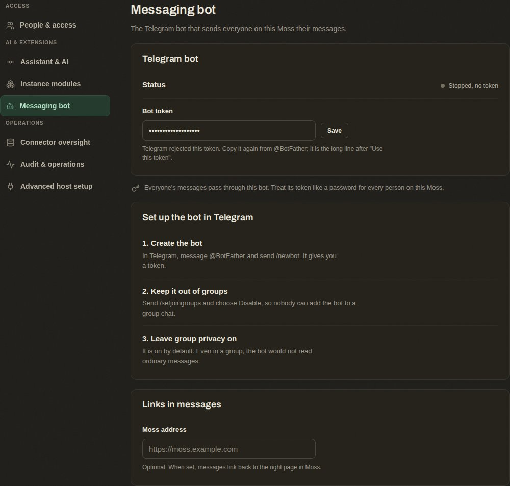 |
| Connected and listening                 | 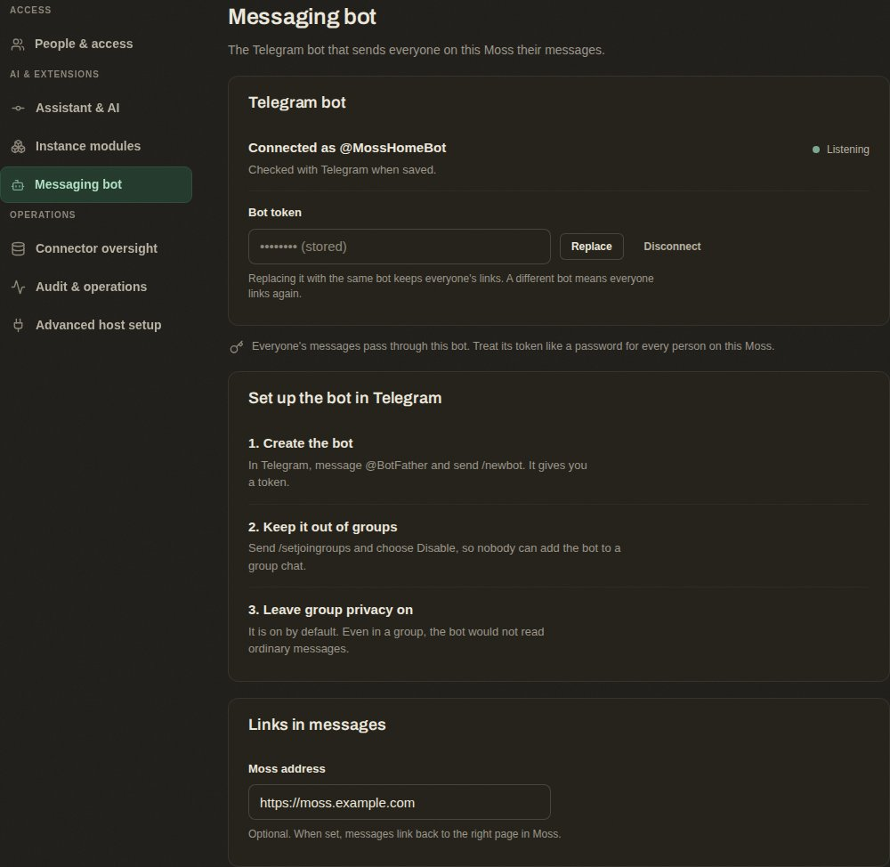       |
| Telegram unreachable                    | 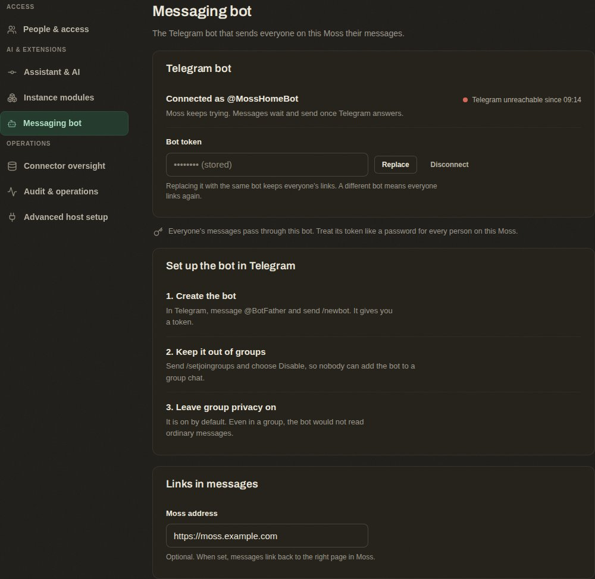     |
| Another Moss process is listening       | 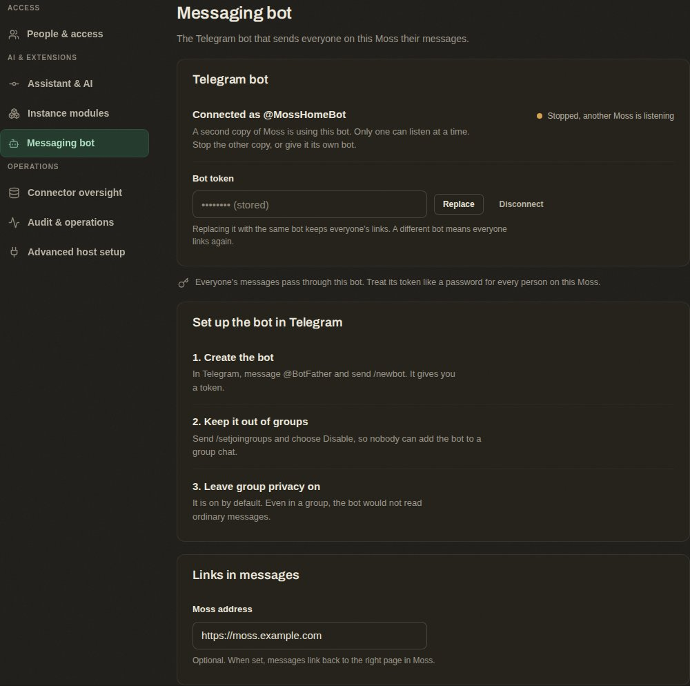      |
| Disconnected, existing bindings waiting | 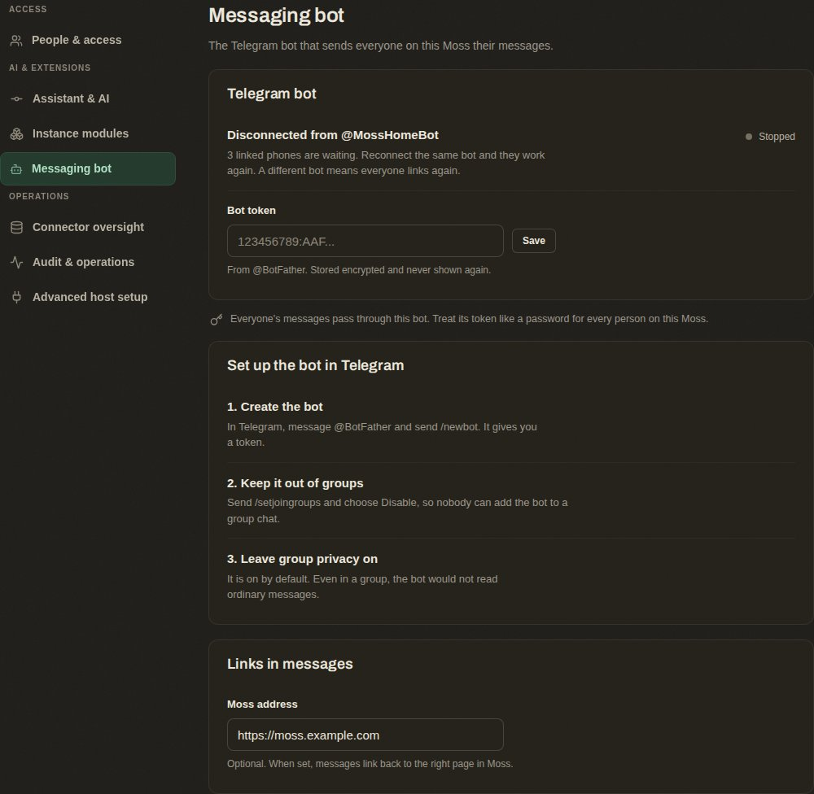      |

- Paste the bot token. On save, Moss checks it with `getMe` and shows "Connected as @name" or
  the real refusal ("Telegram rejected this token"). The token is never shown again.
- Optional Moss address for links, with one line saying what it is for.
- The two BotFather hygiene commands with their one-line reasons.
- Receiver state in plain words, "Listening", "Stopped, no token", "Stopped, another Moss
  process is listening", "Telegram unreachable since 09:14". One line per bot; version one
  has one.
- One line saying that everyone's messages pass through this bot and its token, so the token
  should be treated like a password for every user on the instance (5.11).
- Disconnect, which deletes the token and stops the receiver. Existing bindings stay and show
  "bot disconnected" until an admin reconnects the same bot. Connecting a different bot
  means users link again (5.8).

User screen, "Messaging" under the user's own settings (user scope). It sits in the personal
settings under "Connections", after "Integrations".

| State                                  | Mockup                                                       |
| -------------------------------------- | ------------------------------------------------------------ |
| No bot connected yet                   | 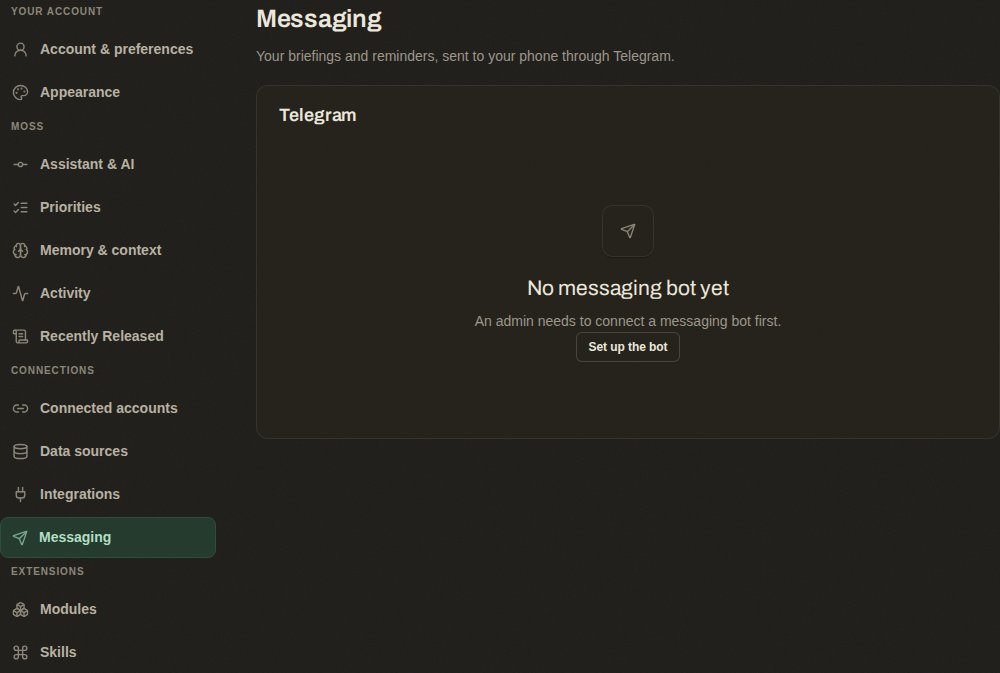   |
| Bot connected, no phones linked        | 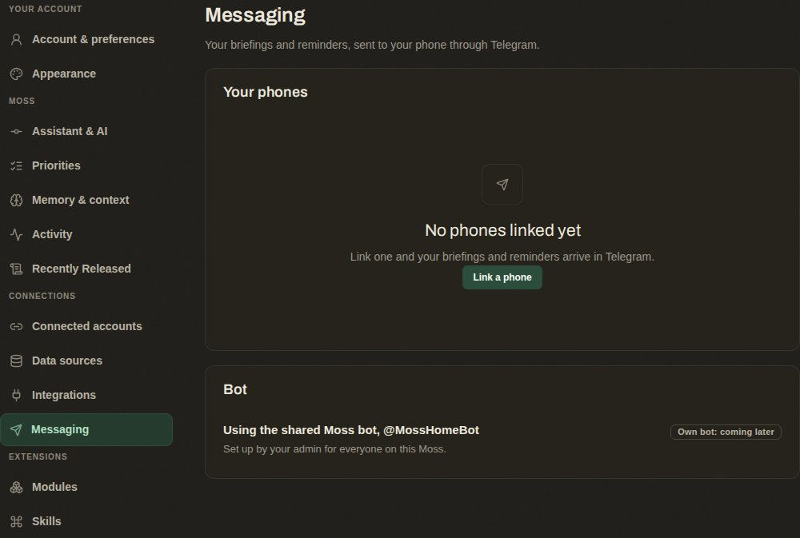    |
| Linking, waiting for the message       | 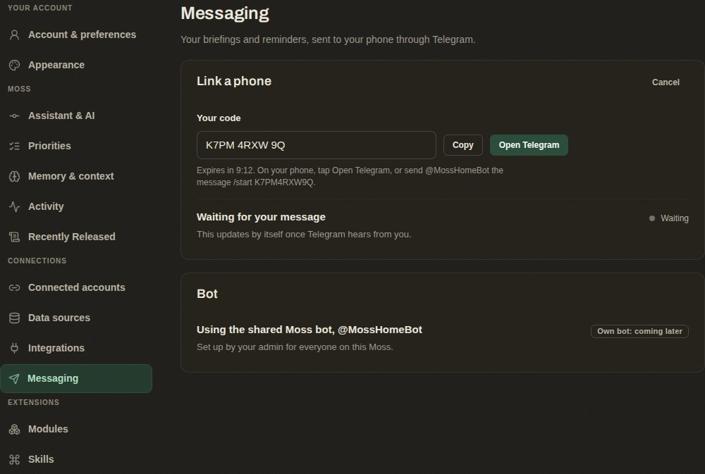 |
| Link code expired                      | 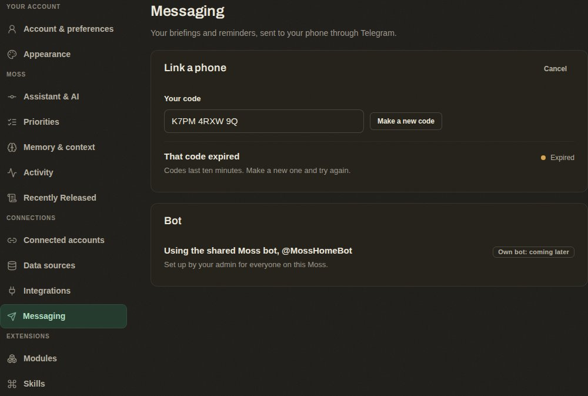 |
| Phones linked, one no longer reachable | 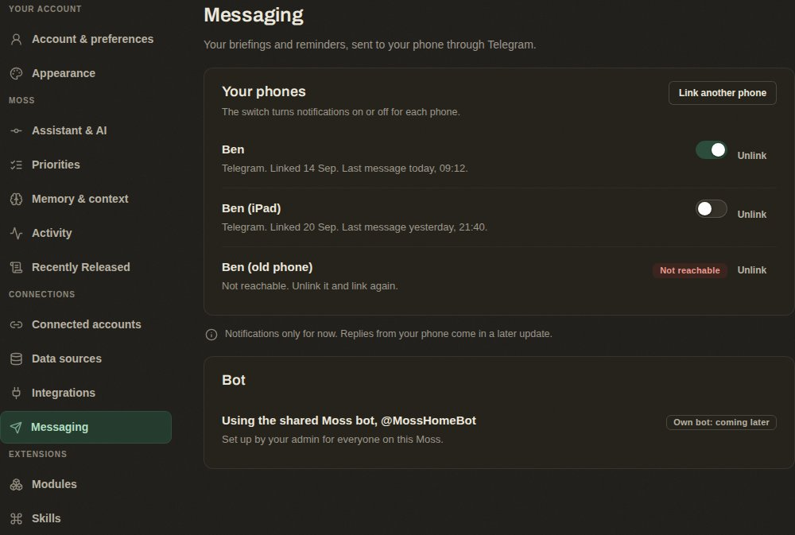  |

Loading uses the existing settings pattern: a pane renders nothing until its query returns.
The "Own bot: coming later" badge holds the place for the optional own-bot path (5.11).

- "Link a phone" produces the code and the tap-to-open link, with a countdown and "make a new
  code". State reads "waiting for your message" until the binding lands, then the row appears.
- Linked chats, one row each, with the Telegram display name, linked date, last message time,
  a "deliver notifications here" switch, and Unlink.
- A disabled row reads "Not reachable, unlink and link again".
- Empty state when no bot is connected reads "An admin needs to connect a messaging bot
  first", and for the single-user case links straight to the admin screen.
- Not in version one, but the layout should leave room for it: an optional "use my own bot"
  path where the user pastes their own token instead of using the instance bot (5.11).

Design system. `@moss/ui` and `@moss/settings-ui` primitives only (`Group`, `Row`, `Field`,
`Note`, `Switch`, `Badge`, `Indicator`, `EmptyState`, `Button`), tokens for colour, no
module-local colour. Run the invented-class audit before the pull request.

## 10. Decisions Ben is likely to want to argue with

Approval previews and the full notification body going to the phone were in this list in
the first draft. Ben settled both on 2026-09-15 (section 1) and they are no longer open.

- **The receiver and the handler both live in the API process (5.4).** The handler must,
  because that is where the assistant lives. The receiver could live in the worker and only
  write rows and jobs, which would keep the API process from being the single poller. That is
  not done because it buys nothing until a second API instance exists, and it moves the
  Telegram token to a second process.
- **An inbound message is stored in a holding row for a few seconds (5.4).** The alternative
  is putting the text in the job payload, which the metadata-only rule forbids, or handling
  the turn inside the receiver, which puts the assistant under the Telegram lock.
- **One sentence to strangers (7).** The alternative is total silence.
- **Long polling before webhooks (5.4).** It fits a tailnet-only instance and needs no public
  address. An install with a public address gets nothing worse than a few seconds of latency.
- **A shared bot, with the exposure that carries (5.11).** Settled 2026-09-15. The
  alternative, every user creating their own bot, was rejected for onboarding cost. The
  tables are keyed per bot so a user's own token can be added later without a key change.
- **Silence while a turn is running (5.4).** Settled 2026-09-15. An acknowledgement can be
  added later with one extra send if silence annoys him in use.

## 11. Testing

- Unit. Code generation and hashing; message splitting at the adapter's declared limit;
  approval message rendering with the id as the only callback data, with and without inline
  buttons; the failure counter rules (403 disables, five failures disable, success resets);
  the unknown-sender window; the 409 backoff.
- Integration. Redeeming a code binds a private chat and refuses a group chat, a mismatched
  sender, an expired code, a consumed code and a code issued for a different bot row.
  Reconnecting the same bot keeps bindings and poll position; connecting a different bot
  leaves the old bindings disconnected. Creating a notification enqueues the fan-out
  job with a metadata-only payload. The delivery target reads bindings only inside the
  recipient's data context. The receiver writes a holding row only inside the resolved
  owner's context and the queued job carries ids only, no text. The handler deletes the
  holding row after the turn. A second message during a turn is retried, not refused.
  Another user cannot read, resolve or delete a binding, a code, a holding row or an action
  request. Export excludes the codes table and the holding table. The bot token never
  appears in a settings response, a log line or a job row.
- Adapter. Telegram calls are exercised against a recorded fake so the suite needs no network
  and no token.
- e2e. Both settings screens through their states with the adapter stubbed.
- Live-path gate, recorded on the pull request. On the dev instance, connect a real test bot,
  link a real phone, receive a real briefing notification, ask the bot a question that calls
  a read tool, ask it to do something that needs approval, approve it from the phone, and see
  the action land in the app. Slice 1 proves through receipt; slice 2 proves through the
  approval.

## 12. App map declarations touched

- Channels manifest `settings`: the admin "Messaging bot" entry and the user "Messaging" entry,
  each with path, scope and the permission that gates it.
- Channels manifest `features`: linking a phone, receiving notifications on the phone, chatting
  from the phone, approving an action from the phone. Each with its errors and remediations,
  at least: token rejected (fix on the admin screen), no bot connected (admin connects one),
  code expired (make a new one), chat not reachable (unlink and link again), another process
  is polling (stop the other Moss process), no assistant model set up (Settings, Assistant &
  AI).
- Notifications manifest and package header: the delivery description changes from in-app
  only to in-app plus registered delivery targets.
- Core app map: no new core screen. Both screens are module-owned and declared in the channels
  manifest.

## 13. Hard invariants honored

No admin bypass and no BYPASSRLS role; the two definer functions return an owner id only.
The one exposure that rule does not cover, the shared bot token, is named in section 6
rather than hidden.
Owner-only rows for bindings, codes, inbound holding rows, threads and action requests. The
bot token is encrypted at rest and never leaves the server. Job payloads carry ids and a
timestamp; inbound message text waits in an owner-only row, never in a payload. Module SQL lives
in the module's own folder as new files. No new required env var; the token and the address
are set in the app. App map updated in the same pull request. AI stays provider-agnostic; the
phone gets whatever model the user configured. Modules collaborate through the notifications
fan-out and the chat session manager's public methods only.
