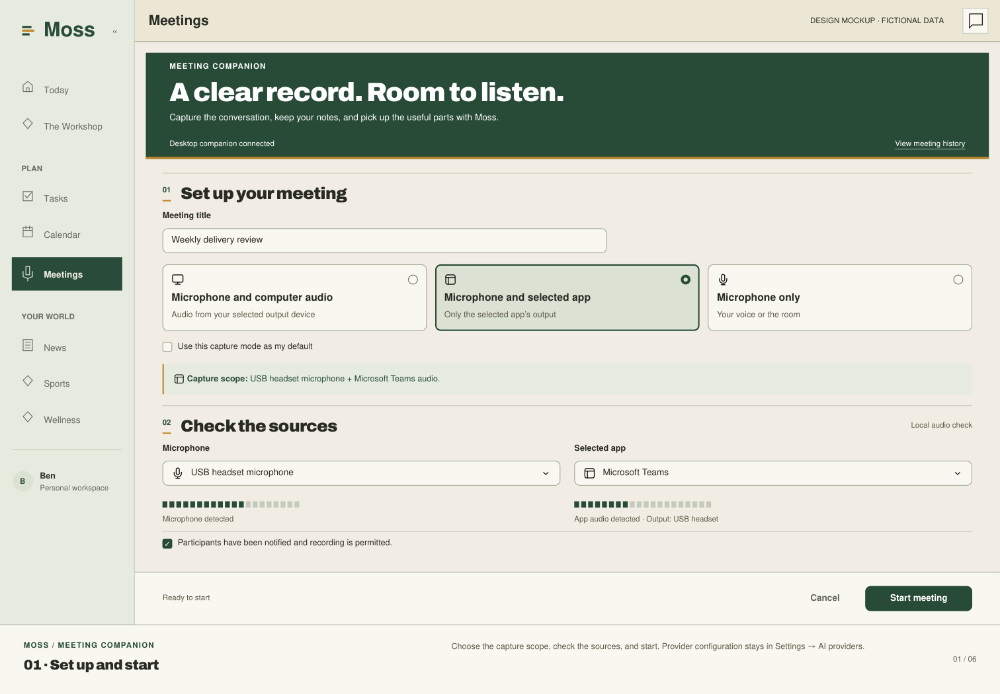
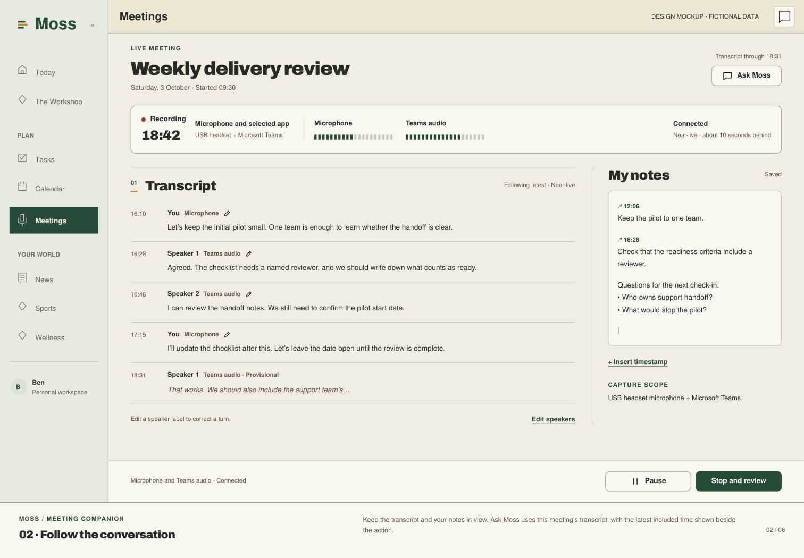
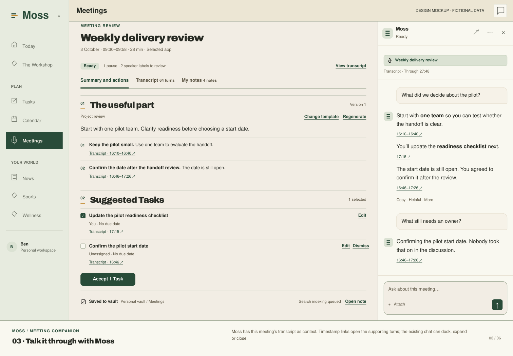
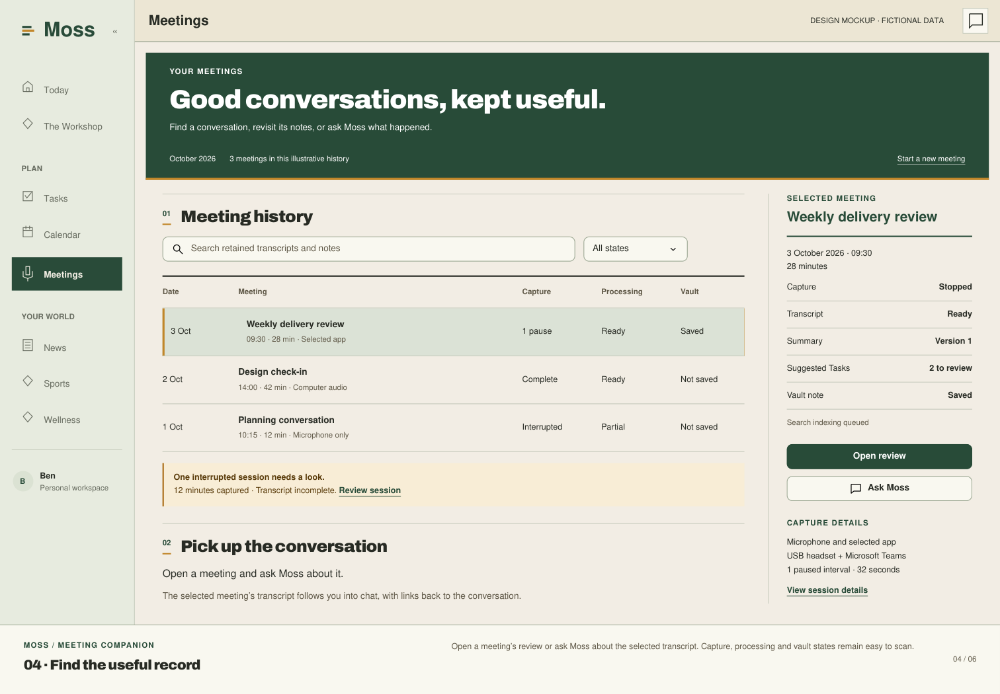
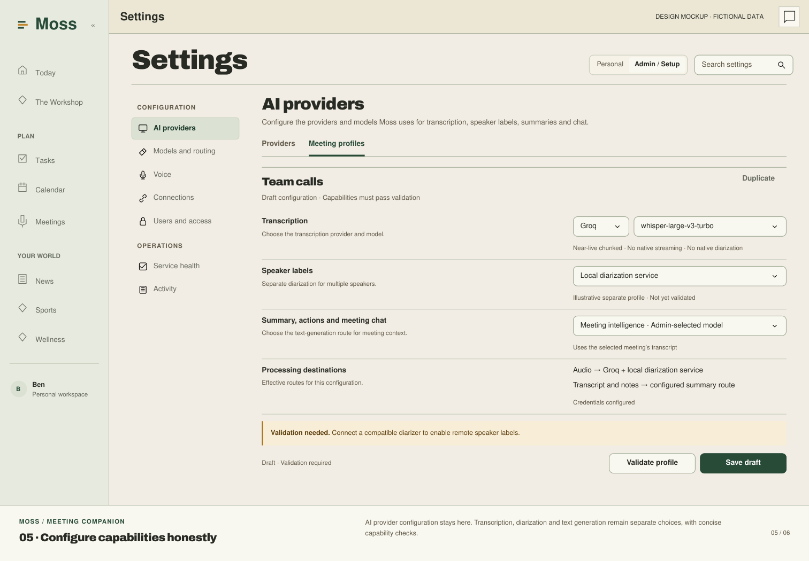
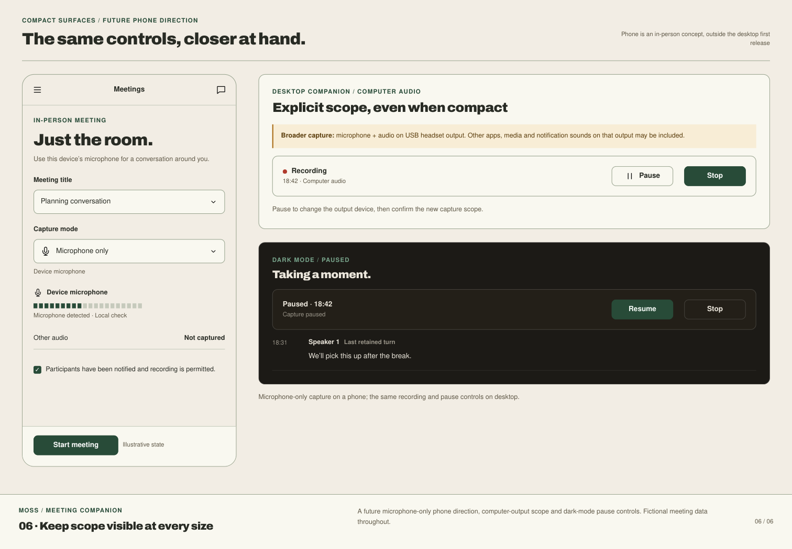

# Moss meeting companion specification

Approved product design; implementation and release verification pending

Version 0.4 • 6 October 2026 • Build issue #2981

## 1 Purpose and decisions

Build a meeting companion with three explicit capture modes: microphone and computer audio, microphone and selected app, or microphone only. Present a useful transcript during the meeting and produce editable notes, decisions, and suggested Tasks afterward. Save the reviewed result to the existing notes vault. Keep transcription, speaker attribution, and summarization independently configurable so the feature does not depend on one AI provider.

The product direction and revised mockups were approved on 3 October 2026; implementation was requested. It defines the product behavior, integration boundaries, and proof needed before release. Approval of this document does not establish workplace permission to record or send meeting audio to a provider. Approved mockups are embedded below; implementation is tracked in #2981. [1]

### Confirmed direction

- macOS and Windows are the primary operating systems. Teams and Zoom are the initial meeting apps.
- The desired outcome includes transcription, speakers, summary and actions, Tasks, a vault save, and chatting with Moss using the selected meeting transcript during and after the meeting.
- Cloud processing is acceptable in principle. Groq is an initial candidate, but the transcription provider and model must remain admin-designated and model agnostic.
- Phone-call capture is deferred. Mobile in-person capture remains a later phase.
- Microphone + system audio is the default. Mode changes live only in Meetings Settings; existing saved exact choices are never broadened as a fallback. Follow the approved four-state Moss design in #3087.
- Processing and model configuration belongs in Settings → AI providers. Linking follows the native app’s existing flow. Interface copy stays concise.

### Approved reliability and connection revision (7 October 2026)

The four-state design in `2026-10-06-meetings-minimal-design.md` supersedes earlier setup and control-layout descriptions below.

Owner testing of PR #3056 found unreliable capture and too much setup friction. The revised
product direction is: connect the companion once, then use one Start meeting action in Moss.
Use the OS-default microphone and system audio for a fresh account, with no source questions.
Keep existing saved exact device/microphone/app choices scoped until an explicit Settings change.
Remove per-meeting Prepare and browser device approval. Complete connection in the current Moss tab rather than opening the OS default browser. List navigation remains
available while a persistent recording control shows the actual capture state.

Connection, capture and transcription are independent. Ordinary timestamp jitter, unchanged
format notifications, brief network gaps and one failed transcription chunk must not be reported
as a lost microphone. Show transcription delay and unrecoverable gaps honestly. Pause and Stop
remain immediately available locally. The bounded memory and authorization limits below still
apply; this revision does not authorize recording on connect, scope broadening, unbounded offline
capture, a disk audio archive, or new live credentials/permissions.

See the [repair plan](../plans/2026-10-06-2981-capture-reliability-and-connection.md) for reproduced
defects, remaining unknowns, the initial-link capability binding and regression gates. Earlier
synthetic/CI passes are not evidence that these real-device failures are resolved.

### Proposed first release

Use native capture adapters and one shared meeting experience. Start manually, keep synchronized microphone and output tracks separate, show the selected sources' health, and provide Pause and Stop controls that actually stop capture. Support Groq-style chunked transcription as a near-live profile, with an independently approved speaker-attribution profile. Offer true streaming through another configured adapter when available; no provider is mandatory.

The first release includes Setup, Live meeting, Review, History, AI provider settings, and meeting context in existing Moss chat. Deferred features are automatic joining or sharing, persistent voice identity, calendar integration, phone calls, universal browser capture, and video recording. Suggested Tasks require owner review.

### Existing Moss constraints

Provider routing must respect per-user pins and fail closed. Meeting data is owner-only unless explicitly shared, including when the reader is an admin. Modules use declared public APIs and events; credentials stay server-side; jobs contain metadata only; vault access follows VaultContext. These are existing repository rules, not new optional defaults. [1–5]

Defaults and targets below are proposed. Current-code observations are sourced; implementation and live proof are still required.

<!-- PAGE -->

## 2 Capture and platform behavior

### Three explicit capture modes

CAP 1. Default to microphone + system audio using the Mac’s OS-default microphone. Change audio mode only in Meetings Settings. Preserve existing saved exact sources and re-resolve them against current inventory; missing or ambiguous sources never authorize a broader fallback. Mode changes during a meeting require Pause and an explicit Resume with a new source epoch. Keep Pause and Stop available independently.

| Mode | Audio captured |
| Microphone and computer audio | Selected microphone plus the declared computer-output scope. Warn that unrelated apps, notifications, and media can be included. |
| Microphone and selected app | Selected microphone plus the chosen Teams or Zoom process or process tree. Other apps must be excluded. |
| Microphone only | Selected microphone only. Output capture is off, not failed; in-room speech may contain several people. |

CAP 2. Keep microphone and output as separate synchronized tracks on one meeting clock. Show independent meters, source names, last audio time, and permission state. In microphone-only mode, label output “Not captured.” Distinguish silence, mute, disconnection, missing permission, and no stream. Preflight is local-only; provider tests require a disclosed test sample.

### Native routes and scope

CAP 3. Proposed floor: macOS 14.2 plus supported Windows 11 builds, subject to a native spike. On Mac, use Core Audio process taps: selected processes for app mode, or a global tap excluding Moss and its helper processes for computer mode. Validate exact OS availability, permissions, output-device coverage, and process membership. [6]

On Windows, selected-app mode uses process-tree loopback. For computer mode, choose either an endpoint loopback limited to the displayed output device or a validated process-exclusion route that excludes Moss's process tree. Document the route's actual output coverage. Endpoint capture must never be labeled “all outputs.” Do not run endpoint and process capture together for the same sound. Disable Moss playback on a captured endpoint unless exclusion is proven. [7, 17]

The first release validates native Teams and Zoom. Browser meetings, virtual desktops, protected audio, unusual drivers, and Linux have no initial compatibility promise. If the selected scope cannot be captured, explain the limitation and require another explicit mode choice.

### Devices and source changes

Headsets reduce output leaking into the microphone. Validate built-in, USB, and Bluetooth devices. On headset or output change, stop the old route, show the new device and scope, and recheck health before explicit Resume. Keep timestamps continuous, mark any gap, and never capture the same output through both old and new routes.

In app mode, pause both tracks if the selected app exits or restarts. In computer mode, warn when the meeting ends because unrelated audio may continue. Microphone-only mode has no app dependency. Device or route failures never authorize a broader source.

Measure echo and overlap. Preserve source provenance; similar text alone is not a safe reason to delete speech. Exclude or suppress Moss playback. Screen sharing does not imply video or screenshot capture.

### Meeting boundaries

Start requires an explicit click after readiness and permission checks. Keep a persistent recording indicator and keyboard-accessible Pause and Stop controls even when the main window is hidden. Closing a window must either leave that indicator clearly active or prompt to stop. Quitting ends capture and records whether finalization finished.

<!-- PAGE -->

## 3 AI provider settings and speaker attribution

### Settings under AI providers

Current code has a dedicated Voice configuration with base URL, write-only key, model, and enabled state. Its capability routing and hard user pins remain implementation seams. [2–4] In this design, Settings → AI providers owns transcription, speaker processing, summary, and chat model configuration. Meeting Setup contains no processing-profile selector or provider/model details.

AI 1. Configure transcription, speaker attribution, summary, and chat routes under AI providers. Internally, versioned profiles may bind required capabilities. Resolve each against actor restrictions and snapshot the capture profile at Start. Changes apply to new sessions; revocation stops new processing. Setup shows readiness failures as a short error with a Settings link.

AI 2. AI providers shows tested capabilities: chunks or streaming, revisions, timestamps, languages, speakers, limits, and data policy. Disable unsupported controls with a reason. A model name alone does not establish compatibility. Record validation date and adapter version. Keep language, vocabulary, processing, and model controls out of meeting Setup.

AI 3. Missing, revoked, incompatible, or pinned-out capabilities fail closed. Do not send audio or text to another provider to make the feature work. Any approved fallback is explicit in the profile, within the same routing restrictions, visible to the user, and separately verified. A summary failure must not lose a usable transcript.

### Initial Groq profile

Groq Whisper exposes file transcription. The proposed adapter sends bounded chunks for near-live updates, rather than calling this true streaming. Its documented timestamp response is verbose_json; the API describes a single audio track and a 10-second minimum billed duration per request. [8]

Send microphone and output tracks as separate mono requests; microphone-only mode sends one track. The current Moss adapter appends /v1/audio/transcriptions, so its Groq base is https://api.groq.com/openai. Extend parsing for timestamps and chunk identity. [4] Start with proposed 10-second chunks and tune latency, accuracy, cost, and rate limits. Meter each source, retries, overlaps, and diarization separately. Single-track prices are not a full two-source meeting budget.

### A practical speaker solution

Source attribution identifies Microphone and the selected Output scope; a track is not a person. The full speaker profile needs a separately selected, approved diarizer returning time ranges and anonymous IDs, including for several people on a microphone. Align ranges with ASR timestamps. Keep IDs stable within the meeting across chunks, and mark overlap or uncertainty. Computer audio may contain unrelated voices; never infer that every captured voice is a meeting participant.

A Groq ASR profile has no assumed native diarization. Pair it with a validated diarizer adapter, local or approved cloud, under the same routing policy. Until that adapter passes the three-remote-speaker test, label the profile “Source labels only” and do not claim the speaker-separation requirement is complete. A true-streaming ASR adapter is an optional alternative, not a substitute for explicitly choosing speaker handling.

Names are editable per meeting. Let the user rename one occurrence or every segment for that meeting's speaker, and split a mixed turn. Never create or reuse a voiceprint across meetings.

<!-- PAGE -->

## 4 Screens and user controls

The four screens share one meeting identity. Follow the new Moss design system and the screen requirements in section 5. Approved mockups of every screen and state are required before UI implementation. [1, 16]

### Setup

Show the approved ready workspace with an editable title, linked Mac, transcript, notes and one Start recording action. Fresh recording uses the OS-default microphone plus system audio; source changes live only in Meetings Settings. Processing configuration stays in Settings → AI providers. Disabled Start gives a specific actionable remedy.

Start requires compatibility, permissions, authentication and configured processing. Readiness checks and short-lived session authorization happen behind that one action. Local preflight does not send audio. The shared companion connection approval grants the recording capability and retains its policy version. The first explicit Start may request the OS microphone permission; permission approval by itself does not start an expired or cancelled command. Never add a separate Prepare/Approve sequence per meeting.

### Live meeting

Keep title, time, active capture mode, exact output scope, source meters, connection, and transcript delay visible. Computer mode retains a visible broad-capture indicator. Show provisional and final text distinctly with time, source, and speaker labels. Let autoscroll pause while reading, with “Return to latest.” Avoid announcing every partial word to screen readers.

Provide My notes with autosave state and timestamp anchors. Add “Ask Moss” opening shared chat with this meeting selected. Keep Pause, Resume, and Stop accessible. Use short status for missing sources, delay, and gaps. Preserve notes and existing text through failures and generation; enforce that behavior rather than repeating reassurance copy.

The compact indicator shows Recording, Paused, or Stopped in words as well as color. “Transcription delayed” must never look like paused capture. The Stop action leads to Review with visible finalization progress, rather than keeping devices open while summaries generate.

### Review

Present My notes, Transcript, and Summary and actions as distinct areas, with “Ask Moss” available after the meeting. Show relevant gaps and unresolved speakers. Evidence links open transcript ranges or note anchors. Show playback only when audio is retained.

Allow transcript edits, turn splitting, per-meeting speaker correction, template selection, and regeneration. Show the generated version and whether edits or later transcript revisions make it stale. Regeneration creates a proposed new version with comparison or restore; it must preserve manual edits and accepted Tasks.

Each suggested action has editable text, owner status, due-date status, evidence, and an Accept or Dismiss choice. Offer Save to vault separately from Accept selected Tasks. Show the actual target note and Task results, including partial success. No action auto-assigns work to another person or sends a message.

### History and AI providers

History shows only accessible meetings, with date, title, capture completeness, processing state, and export state. Reopen Review, search retained text, or delete under the applicable policy. An empty history is not proof that a failed capture never happened; show recoverable interrupted sessions when known.

Settings → AI providers owns ASR endpoint and model, speaker processing, summary and chat routes, language or vocabulary hints, and processing destinations. Admin settings also govern templates, limits, capture policy, and retention. Restricted modes show a reason. Users choose among allowed defaults; configuration authority grants no transcript access. [1–3]

<!-- PAGE -->

## 5 Design system and meeting chat

Use the current Moss design system, with Today as the visual standard except for documented defects. Reuse the shared chat and its interaction patterns. [16]

### Shared visual rules

Use Archivo headings, system sans, an 11px floor, and semantic tokens. No serif or non-code monospace. Use flat paper sections and hairlines; Card is for contained settings or widgets. Gold decorates, amber signals caution, and red marks genuine errors or destructive actions. Use shared @moss/ui primitives and legal variants; extend shared components when needed.

Keep 8px between adjacent controls and labels, 12px around control groups, 20px between blocks, and 32px between sections. Text contrast is at least 4.5 to 1, or 3 to 1 for large text. Check light, dark, a park theme, keyboard focus, and narrow widths. Avoid decorative card grids, flat-surface shadows, curved accent borders, mascots, and Sparkles.

Copy names actions and current states. Avoid repeated promises such as “nothing leaves” or “Moss will not replace.” Keep accurate source descriptions and actionable errors where they help a decision. Security and edit-preservation rules belong in implementation and tests.

### Screen primitives

Setup uses Masthead, Field, Segmented or Select, Switch, Indicator, and Button. Live and Review add shared tabs, Divider, Menu, Dialog, and PeekPanel for evidence. History uses RowIndex, filters, and EmptyState. AI providers uses Field, Select, Switch, Button, and contained Card. Ask Moss uses the existing Thread and shared composer with a meeting Chip; no parallel chatbot.

### Meeting context in Moss chat

CHAT 1. Opening Ask Moss selects the current meeting in shared chat. Each new turn automatically uses its latest authorized transcript, including corrections, live and after Stop. Retrieve bounded relevant segments plus scoped context, rather than promising the entire transcript fits in one prompt. State material retrieval gaps when they affect an answer.

CHAT 2. At submission, bind the turn to owner, meeting ID, transcript revision, event cutoff, and selected ranges. Final text is the main evidence; label any provisional text used for a live question. Show concise coverage such as “Through 12:34.” Cite clickable timestamps pinned to exact revisions; links open supporting ranges. Later edits affect new turns. Earlier citations retain their version or show it unavailable.

CHAT 3. Bind asynchronous retrieval and generation to that snapshot. Switching meetings cannot redirect an in-flight turn, mix contexts, or display its answer under a new meeting. Check access before retrieval and before releasing results; suppress inaccessible responses after revocation. Source edits may mark earlier answers outdated without rewriting them.

CHAT 4. Retrieve only the selected meeting unless the user explicitly expands scope. Treat transcript content as untrusted evidence, including spoken instructions. It cannot authorize tools or override routing, privacy, or existing action approvals. Saving notes and creating Tasks use the existing review flow. Chatting alone changes no accepted outputs.

Mockups cover Setup modes, capture failures, live and completed Ask Moss, provisional or stale citations, empty History, and unavailable AI configuration. Static examples are design content, not live proof.

<!-- PAGE -->

## 6 Session lifecycle and reliable transport

### State model

The conceptual lifecycle is Draft, Ready, Recording, Paused, Stopping, Processing, and Reviewable. Failed and Interrupted carry a reason and recoverable artifacts. Capture, transcription, summary, and export each have their own status; a failure in one must not falsely mark every part failed. Stop and close are idempotent.

Ready requires preflight. Each explicit Start binds owner, device, current connection generation, mode, precise output scope, sources, profile and the approved recording-capability revision. Connecting or reconnecting never creates a Start. A command must be claimed within its bounded lifetime; a stale command cannot start capture after restart. Pause immediately stops capture and every new outbound audio send, including queued chunks. Already submitted audio may still return results, labeled as pre-pause processing. Freeze queues within their expiry limits. Resume rechecks policy and permissions, explicitly permits sending retained pre-pause audio, and starts a new epoch with a visible gap. Mode or scope changes require review before Resume. Stop releases devices and fixes an immutable cutoff; its disclosed finalization may flush the final partial chunk and retry retained pre-cutoff audio, never post-cutoff samples.

### Ordering and revisions

TRAN 1. Timestamp each source with a monotonic device clock mapped to a common meeting origin. Store wall-clock start and timezone separately for display and date interpretation. Do not order text solely by network arrival. Track clock discontinuities and source changes.

TRAN 2. Each audio envelope carries meeting ID, source ID, epoch, sequence, offsets, format, and a content hash. Distinguish received from processed acknowledgements. A receive acknowledgement transfers bounded buffering responsibility; it does not prove ASR or diarization succeeded. Release audio after all required consumers finish, a terminal error, or expiry, recording any resulting gap. Reject conflicting duplicates. Segment IDs survive revisions; increasing revision numbers and finality flags prevent stale updates replacing newer text.

TRAN 3. Reconnect sends the last acknowledged cursor and reconciles missing ranges. Replay only unacknowledged material still available under the buffering policy. Deduplicate overlaps by time and source rather than concatenating responses. Every unrecoverable missing interval becomes a gap event with cause and duration, visible in Review and available to summarization.

### Backpressure and close

Repair limits: at most 60 seconds of unacknowledged in-memory audio per source, with explicit sample/byte and total-process caps, and an initial two-hour session limit. State the shorter effective capacity at the active sample rate. Monitor queue age, memory, upload failures and provider limits. Warn at 30 seconds of backlog or earlier byte-pressure. At the cap, visibly pause capture; mark any already lost interval as a gap. An individual processing failure may release only its terminal chunk with a visible gap; transient failures retain/retry the same chunk within the bound. Never let one slow source starve another, consume unbounded memory, or drop audio silently.

The default proposal keeps raw audio transient. A crash, long outage, or failed request may lose unacknowledged audio. The optional recovery buffer in section 9 changes that tradeoff. Do not promise offline transcription, complete crash recovery, or whole-meeting re-transcription without retained audio.

After Stop, close with final sequence boundaries for each source. Flush and drain only pre-cutoff audio within a proposed 60-second deadline, then mark unfinished ranges pending or failed and allow Review. Late results create transcript revisions and mark dependent output stale without rewriting reviewed summaries, exports, or accepted Tasks. A bounded server-side capture lease expires abandoned sessions as Interrupted. Its local deadline must exceed individual request deadlines and tolerate brief network gaps; expiry pauses locally and requires explicit Resume, not automatic recording after reconnect. Terminal finalization releases the recorder/session slot without requiring manual device disconnection; pending pre-cutoff processing remains distinct from live capture. If the responsible client or server crashes without a retained copy, record the affected gap rather than claiming recovery.

<!-- PAGE -->

## 7 Data and service contracts

These are proposed logical contracts, not existing endpoint paths or database migrations. Implement them through Moss's plain REST and shared TypeScript contract conventions, with a streaming event channel where justified. Keep the existing dictation contract compatible. [1, 4]

| Record | Required fields and rules |
| Meeting | Stable ID, owner, title, created time, start and timezone, capture mode, exact scope, state, completeness, profile, policy snapshot, retention deadlines |
| Source | Stable ID, microphone or output, app or endpoint identity, native route and exclusions, epoch, format, shared clock mapping, health, capture boundaries |
| Transcript segment | Stable ID, source and epoch, offsets, text, revision, provisional or final, anonymous speaker ID or unknown, attribution method, optional provider confidence, edit provenance |
| Gap and lifecycle event | Event ID, monotonic sequence, type, affected source, offset range, reason, server time; no fabricated speech for gaps |
| Personal note | Stable note or block ID, text, optional meeting offset, edit version; user-authored content stays separate |
| Generated artifact | Artifact ID, version, input versions, template version, model route, evidence pinned to segment or note revision and exact range, generated time, user edits, stale status |
| Action candidate | Stable candidate ID, source artifact version, proposed text, optional speaker or owner reference and date, evidence, review state, accepted Task ID |
| Export receipt | Meeting ID, destination identity, artifact version and hash, stable idempotency key, write status, index status, note reference, timestamps, retryable error |
| Meeting chat turn | Owner, thread and turn IDs, meeting ID, transcript revision, cutoff, retrieved ranges and finality, citation anchors, route, authorization outcome |

### Operations and events

Support preflight; create and start; audio or stream submission; events; pause and resume; stop and finalize; read and edit; regenerate; accept actions; export; and delete. Expose bounded transcript retrieval and revision-pinned evidence to existing Moss chat. Authorize every operation, including events, uploads, chat retrieval, and jobs.

Use expected versions for edits and regeneration. Return a conflict with the current revision instead of overwriting concurrent changes. Retryable mutations require an idempotency key; replay returns the original outcome. Event delivery is at least once, with a monotonically increasing cursor and client deduplication.

Expose typed failures: permission denied, source unavailable, unsupported capability, admin pin unavailable, unauthenticated or revoked, rate limited, queue full, provider unavailable, conflict, partial finalization, vault write failed, and index delayed. Include a safe remediation and retryability without leaking credentials or private content in errors.

Jobs contain actor and resource IDs, input version, job kind, and idempotency key. Workers fetch authorized content through the owning module's public interface. Do not place audio, transcripts, prompts, or secrets in job payloads. Keep diagnostic logs content-free by default. [1]

<!-- PAGE -->

## 8 Grounded summaries and durable outputs

### Summary and template behavior

SUM 1. Use the existing capability-based AI route for summarization, independently from transcription. Generate an overview, decisions, open questions, and suggested actions from the retained transcript and My notes. Treat transcript text as evidence, never as instructions to execute tools or reveal secrets. Flag gaps and uncertain attribution where they affect a claim.

SUM 2. Every decision and action needs evidence pinned to a segment or note revision and exact range. Identify personal notes as user-authored. Later edits must not redirect an old claim to changed text. When evidence expires or is deleted, mark it unavailable; retain excerpts in exports or Tasks only under an explicit authorized retention policy. Do not invent attendance, consensus, owners, commitments, or deadlines. Resolve relative dates only when the meeting date and timezone make them unambiguous; preserve the phrase for review.

Templates are versioned content structure and guidance. Admins manage approved templates; users may select or create personal templates if allowed. Template permission does not confer sharing permission. Start with general meeting, one-to-one, project review, and interview structures as proposed templates, with the same evidence rules. Store the exact template version used.

### Suggested Tasks

TASK 1. Tasks remain the single action surface. Meeting actions stay reviewable candidates until the owner accepts them through the Tasks public API. Use meeting provenance in source and source_ref and a stable external key derived from meeting ID and candidate ID. Do not create a parallel commitment system. [5]

TASK 2. Repeated acceptance returns the existing Task. Preserve accepted text, owner, due date, and later user edits. A regeneration reconciles against stable candidate identities and keeps accepted or dismissed decisions; it presents uncertain matches for review rather than duplicating or deleting them. A changed action becomes a proposed update. No remote participant is automatically assigned a Task, invited, notified, or contacted.

### Notes vault and export receipts

VAULT 1. Save only after an explicit user action. Default to a private destination and check its effective audience; access to a shared vault is not permission to share meeting content. Disclose that audience and obtain approval before a shared export. Use the Notes public write interface and VaultContext. A stable meeting ID determines export identity despite title changes. Keep destination, artifact version, hash, and separate write and index outcomes in the receipt.

Current Notes code writes the file before it enqueues indexing. Its synced true response means enqueue succeeded, not that search indexing completed. A failure after the write can therefore be a partial success. The meeting export must reconcile the target and receipt before retrying, then retry only the missing stage. [9]

VAULT 2. Display “Saved to vault” only after confirming the write; display “Search indexing queued” or “Indexed” separately. A repeat export with unchanged content is a no-op. Changed content offers an explicit update, with a conflict check that protects manual note edits. Never append the same summary repeatedly or overwrite user additions during a retry.

<!-- PAGE -->

## 9 Privacy retention and authentication

### Ownership and authorization

Moss requires owner-only data unless explicitly shared, with no admin private-data bypass. Apply this to audio, transcripts, notes, summaries, chat context and answers, evidence, exports, search, and events. Chat caches and indexes carry the same scope and retention. Admin health or usage views expose no private content. [1]

The existing Trail Marker credential remains an identity/connection credential, never general meeting, transcript, note, Task or admin authorization. The single initial linking approval grants a separate owner/device recording capability, bound to the supported policy version and independent native proof. The linking capabilities list says “Record meetings when you choose Start”; there is no recording disclosure paragraph or second approval in Settings. Initial approval is cookie-only and origin-bound. The proof is kept in the native Keychain; the legacy connection credential alone cannot impersonate a recorder. Existing Macs without recording authorization, or with revoked access, must explicitly sign out under Settings → Active sessions and relink through Trail Marker. Already-approved Macs remain linked. Legacy attempt/decide mutation routes retain their authentication/origin checks and return 410 to authenticated callers. Read-only status recovery may restore only an exact already-approved candidate whose owner, device, policy, proof and revision still match live authority; it never opens a new attempt or grants permission. Expiry and revocation checks remain in force, and Backtrack consent stays independent.

Readiness/command bootstrap must verify device identity, that capability and its independent proof. Only an explicit, current browser Start may create short-lived exact meeting/device authority; bootstrap may claim only that current, bounded command. Audio/status/control remain authorized by the meeting grant rather than the bare companion credential. Claims and Start retries must be idempotent without retaining plaintext credentials server-side. Device/capability revocation, account changes and browser-session revocation invalidate derived authority; late callbacks cannot restore it. Provider keys remain on the server. These are requirements to verify end to end, not claims that live grants have been changed. [10]

Trail Marker is currently an unsigned, un-notarized local macOS development build. Packaging, stable signing, OS permissions, update trust, and Windows distribution need release decisions before an installable companion is promised. Do not instruct users to bypass platform security warnings as a shipping workflow. [11]

### Proposed retention defaults

No permanent raw-audio archive by default. Use bounded transient memory; retain audio only while required ASR and diarization consumers need it, within a proposed 60-second processing expiry. Receipt alone is not completion. Delete on completion, terminal error, expiry, or final close, recording gaps where needed. This limits recovery, replay, and later re-transcription. Disable playback when no audio exists.

Offer an optional encrypted recovery buffer only after its storage design is approved. Proposed retention TTL: 15 minutes, without increasing the 60-second capture-backlog limit. Delete when required processing finishes, on terminal error, or expiry. Define client and server ownership separately, OS-protected keys where applicable, accurate deletion guarantees, and startup cleanup. Opt-in must disclose temporary retention. Longer recording archives are outside the first release.

Set separate retention policies for transient audio, any recovery buffer, transcript, personal notes, summaries, and export receipts. Proposed application-artifact default: retain until the owner deletes them, subject to an admin-configured maximum; the maximum still needs a product decision. Vault copies and accepted Tasks have separate lifecycles. Deleting a meeting must clearly say which copied outputs remain and require an explicit choice to remove them where supported.

### Workplace and provider requirements

Before deployment, verify approved providers, data region, training use and vendor retention. Product planning does not authorize sending actual workplace recordings. Real audio acceptance remains owner-controlled.

Describe processing destinations and policy in AI providers. Audio choice lives in Meetings Settings and remains separate from provider permission. Prevent undisclosed fallback, exclude content and secrets from telemetry, and verify deletion across storage, chat caches, providers, and backups.

<!-- PAGE -->

## 10 Acceptance and proof

All numeric thresholds below are proposed release targets. Record actual measurements and failures. Unit tests and generated fixtures support development, but release also needs live end-to-end evidence through the real UI on a live development instance. Do not label mocked audio or staged screenshots as proof of working capture. [1]

| Test | Required observable result |
| Platform and modes | Real two-person Teams and Zoom meetings on both operating systems. Test both output modes and microphone-only capture; record exact OS, app, native route, devices, profile, and build. |
| Capture scope | App mode excludes unrelated audio; computer mode includes only its declared scope and displays the privacy warning. Mic-only opens no output capture. Moss playback is excluded or suppressed. |
| Defaults and switching | First use requires a choice. Only an explicit default is saved. Per-meeting overrides work. Failure never broadens scope; changing mode requires Pause and explicit Resume. |
| Setup and AI settings | Setup has capture controls and short errors, with no processing-profile or model details. Configure routes through Settings → AI providers. |
| Transcription timing | Proposed P95 final text delay is at most 20 seconds in the 10-second chunk profile, or 3 seconds for a declared streaming profile, measured from utterance end under the documented network and hardware conditions. |
| Pause resume stop | Within 1 second, capture stops. Pause starts no new audio sends; Stop flushes only pre-cutoff samples, including a partial final chunk. Resume records a gap and epoch; a stopped session cannot resume. |
| Multiple remote speakers | One local plus three remote speakers. At least 90% of manually labeled, non-overlapping remote speech duration is attributed to the correct anonymous speaker. Overlap and uncertainty are visible; no invented names. |
| Disconnect and backpressure | Interrupt the network for 30 and 90 seconds. Accepted content is not duplicated. Missing audio is replayed only when retained, otherwise marked as a gap. Queue limits are enforced visibly. |
| Device and app changes | Change headset and output, revoke permission, and restart the app. Old and new routes never capture twice; gaps and scope are shown. Endpoint-only mode never claims all outputs. |
| Grounded outputs | In a reviewed 20-meeting pilot, every decision and action has a valid evidence link; zero invented owners or dates. Unassigned actions remain unassigned. Report transcription errors separately. |
| Output idempotency | Repeat Task acceptance and vault export three times. One accepted Task per candidate and one note per meeting destination. Edited Tasks and vault text survive regeneration and retry. |
| Partial export | Force failure after a successful note write but before indexing enqueue. Show saved plus indexing failure, reconcile the receipt, retry indexing, and produce no second note. |
| Access and routing | Another user and an admin without a grant cannot read any meeting artifact or event. A pinned-out model sends no audio or transcript to another provider. Revoked device authorization stops new submissions. |
| Retention and recovery | Verify memory and optional buffer expiry, crash cleanup, artifact deletion, and accurate retained-copy notices. No claimed playback or recovery where audio is unavailable. |
| Meeting chat | Live and completed questions use current scoped edits. Citations open exact revisions and timestamps; cutoff and provisional text are truthful. Switching meetings or revoking access mid-generation leaks no context. Spoken tool instructions execute nothing. |

Test a 60-minute session with accents, names, silence, and overlap. Proposed word error rate target: 15% or less under agreed conditions. Measure long-transcript chat retrieval and evidence accuracy. Hold or label profiles that miss targets.

<!-- PAGE -->

## 11 Delivery plan and remaining decisions

### Phase 0 Lock the design and prove capture

Review the revised mockups: capture-focused Setup, Ask Moss live and afterward, and Settings → AI providers, using the approved visual direction. Create the task and design record before build. Validate both operating systems, native scope, signing, and supported builds. Keep the app map accurate. [1, 16]

### Phase 1 Complete one vertical path

Implement capture modes, defaults, synchronized tracks, lifecycle, configured ASR, transcript revisions, notes, and safe Stop. Add the diarizer and pass multi-speaker tests. Connect scoped, snapshot-bound transcript retrieval to existing Moss chat. Add grounded summaries, reviewed Tasks, and duplicate-safe vault writes through public interfaces.

Ship the smallest complete path with truthful limitations. A source-only prototype can validate capture and transcription, but does not satisfy the full requested speaker feature. Groq access makes a useful candidate for the chunk profile; account configuration and actual workplace audio use require their own authorization and policy review.

### Phase 2 Harden and pilot

Complete authentication isolation, revocation, error recovery, buffer policy, retention, version conflicts, export reconciliation, and the full acceptance matrix. Run the 20-meeting pilot with authorized participants and content. Review quality, latency, cost per captured meeting hour, and failure rates separately for each processing profile. Keep live proof on the implementation PR before merge and release. [1]

### Later work

Add mobile in-person microphone capture using the same session and artifact contracts after selecting iOS and Android scope and permissions. Add optional true-streaming adapters when approved and useful. Calendar suggestions, explicit sharing, archival audio, and browser-specific capture are separate enhancements. Phone calls remain deferred and must be evaluated by platform rather than promised as universal cross-app capture.

### Decisions still required before native release or workplace deployment

| Decision | Recommended starting point |
| Platform floor and routes | Validate macOS 14.2 plus Windows 11 builds; lock computer-mode output coverage, Moss exclusion, signing, and distribution after the spike. |
| Speaker profile | Select and approve a diarizer independently from ASR. Keep Groq ASR viable; ship source-only mode with a visible limitation until the full profile passes. |
| Recovery and retention | Transient audio by default; optional encrypted buffer with 15-minute expiry. Set maximum artifact retention and verify provider handling before workplace use. |
| Workplace deployment | Confirm allowed recording and cloud-processing destinations, including diarization, with the relevant employer policy owner. |
| Targets and templates | Approve the measurable targets, initial session limits, and general meeting templates. Allow personal templates only within admin policy. |

<!-- PAGE -->

## 12 Sources and integration references

Official documentation was checked on 3 October 2026. Integration observations use commit 5eef54630c71bec759c3282bc026feec8d60e7c6; the current design-system reference uses a968e0a1f0a9e1461e98eaae22886e04c273536c. Proposed contracts and targets remain design decisions.

### Moss repository

[1] [Moss CLAUDE guidance](https://github.com/motioneso/moss/blob/5eef54630c71bec759c3282bc026feec8d60e7c6/CLAUDE.md). Privacy, provider routing, module boundaries, VaultContext, design and mockup prerequisites, app-map updates, and live-path release proof.

[2] [Voice settings](https://github.com/motioneso/moss/blob/5eef54630c71bec759c3282bc026feec8d60e7c6/apps/web/src/settings/settings-voice-config-group.tsx). Existing dedicated admin endpoint, model, key, and enable controls.

[3] [AI capability resolver](https://github.com/motioneso/moss/blob/5eef54630c71bec759c3282bc026feec8d60e7c6/packages/ai/src/repository.ts#L1187-L1286). Per-user hard pins and the explicit Voice route.

[4] [Transcription route](https://github.com/motioneso/moss/blob/5eef54630c71bec759c3282bc026feec8d60e7c6/packages/ai/src/transcription-routes.ts) and [HTTP AI adapter](https://github.com/motioneso/moss/blob/5eef54630c71bec759c3282bc026feec8d60e7c6/packages/ai/src/adapters/http-api.ts#L117-L163). Current single-blob text response and appended transcription path.

[5] [Tasks as the single action surface](https://github.com/motioneso/moss/blob/5eef54630c71bec759c3282bc026feec8d60e7c6/docs/architecture/decisions/0004-tasks-single-action-surface.md). Task provenance and module integration policy.

[9] [Notes write tools](https://github.com/motioneso/moss/blob/5eef54630c71bec759c3282bc026feec8d60e7c6/packages/notes/src/write-tools.ts). File write precedes indexing enqueue; enqueue acknowledgement is not completed indexing. [Related Notes issue 2912](https://github.com/motioneso/moss/issues/2912) provides background on previously reported Notes UAT failures, not proof of a current production outage.

[10] [Companion API contract](https://github.com/motioneso/moss/blob/5eef54630c71bec759c3282bc026feec8d60e7c6/packages/shared/src/companion-api.ts). Existing Trail Marker authorization scope is deliberately restricted.

[11] [Trail Marker README](https://github.com/motioneso/moss/blob/5eef54630c71bec759c3282bc026feec8d60e7c6/apps/trail-marker/README.md). Current macOS development packaging and signing status.

[16] [Moss design system](https://github.com/motioneso/moss/blob/a968e0a1f0a9e1461e98eaae22886e04c273536c/docs/design-system.md). Today is the visual standard, with corrected type floors, contrast, tokens, and shared primitives.

### Platform and provider documentation

[6] [Apple Core Audio process taps](https://developer.apple.com/documentation/coreaudio/capturing-system-audio-with-core-audio-taps). Capture architecture reference; exact shipping baseline remains a native validation item.

[7] [Microsoft application loopback sample](https://learn.microsoft.com/en-us/samples/microsoft/windows-classic-samples/applicationloopbackaudio-sample/). Selected process-tree capture and silence when no rendering stream exists.

[17] [Microsoft loopback recording](https://learn.microsoft.com/en-us/windows/win32/coreaudio/loopback-recording). Endpoint-scoped output capture. The application-loopback sample [7] also documents process-tree exclusion; routes and coverage must be validated separately.

[8] [Groq speech to text](https://console.groq.com/docs/speech-to-text). File transcription, timestamps, single-track behavior, and billing granularity. [Groq SDK transcription contract](https://github.com/groq/groq-typescript/blob/main/src/resources/audio/transcriptions.ts) corroborates verbose_json timestamp parameters.

### Product design references

[12] [tl dv preferences](https://intercom.help/tldv/en/articles/8925840-understanding-and-setting-your-preferences). Model selection, language, privacy, and separate AI hosting controls.

[13] [Otter desktop app](https://help.otter.ai/hc/en-us/articles/35973988280215-Otter-Desktop-App-Mac-Windows). Desktop recording, headset use, persistent indicator, pause, and stop.

[14] [Fireflies speaker corrections](https://guide.fireflies.ai/articles/4994477228-how-to-edit-speaker-labels-or-names-in-a-transcript). Per-occurrence and transcript-wide correction, turn splitting, and regeneration.

[15] [Granola AI enhanced notes](https://docs.granola.ai/help-center/taking-notes/ai-enhanced-notes). Personal notes, transcript evidence, editing, and templates.

## 13 Approved screen mockups

Approved on 3 October 2026. These images contain fictional design examples, not live-path proof. The mobile panel is future direction only. Required empty, loading, failure, and unavailable states remain specified above and must be implemented and tested, not inferred as already working.

### Setup and start

### Live meeting

### Review and shared Moss chat

### Meeting history

### AI provider configuration

### Compact, paused, and future mobile surfaces

